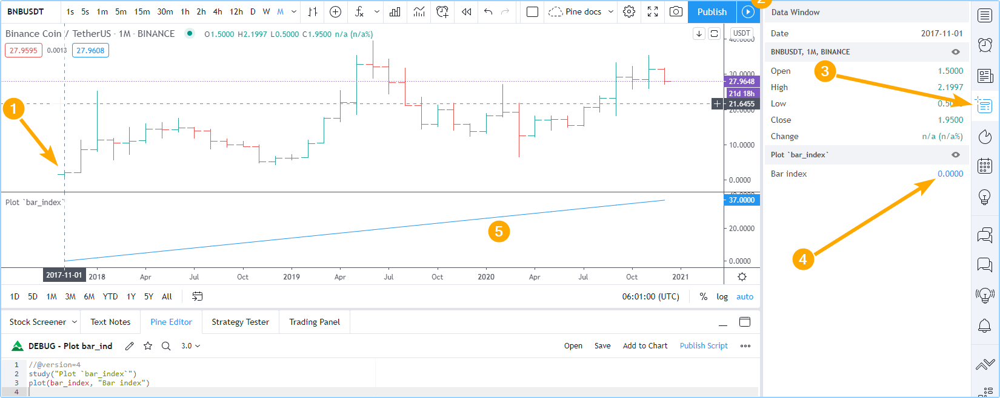

Debugging
=========

.. contents:: :local:
    :depth: 2

Introduction
------------

The close integration in TradingView between the Pine Editor and charts allows for efficient and interactive debugging of Pine code. 
Once a Pine programmer understands the most appropriate technique to debug each type of situation, he will be able to debug quickly and thoroughly. 

If you are not yet familiar with Pine's execution model, it is important that you read the :doc:`/language/Execution_model` page of this User Manual 
so that you can understand how your debugging code will behave in the Pine environment.

Plotting numeric values
-----------------------

The simplest way to inspect numerical values is to just plot them in your script's display area. Whether your script is in a pane or on the chart, 
you will be able to see the variable's value on each bar.

This script plots the value of `bar_index <https://www.tradingview.com/pine-script-reference/v4/#var_bar_index>`__ on each bar. 
``bar_index`` is a built-in variable in Pine. It contains a bar's number, which begins at zero on the dataset's first bar and increases by one on each 
subsequent bar::

    //@version=4
    study("Plot `bar_index`")
    plot(bar_index)

Note the following in the screenshot:

#. The chart's cursor is on the dataset's first bar.
#. The Data Window is show in a vertical pane, to the right of the chart.
#. The fourth icon down the right is used to display the Data Window.
#. In the Data Window, the value of our plot is displayed. Because our cursor is on the first bar, the value of ``bar_index`` on that bar is displayed, i.e., zero. Moving your cursor on other bars will update the value shown so that it always represents the value of the plot on that bar.
#. The `plot() <https://www.tradingview.com/pine-script-reference/v4/#fun_plot>`__ call in our script plots the value of ``bar_index`` as it increases by one on each bar.

Good to know:

- The precision of the values displayed in the Data Window is dependent on the chart symbol's tick value. You can modify it in two ways:

  - By changing the value of the *Precision* field in the script's *Settings/Style* tab. You can obtain up to eight digits of precision using this method.

  - By using the ``precision`` parameter in your script's `study() <https://www.tradingview.com/pine-script-reference/v4/#fun_study>`__ or `strategy() <https://www.tradingview.com/pine-script-reference/v4/#fun_strategy>`__ declaration statement. This method allows specifying up to 16 digits precision.

Many experienced programmers first look for a debugging console when they begin coding in Pine. While a console concept does not exist 

