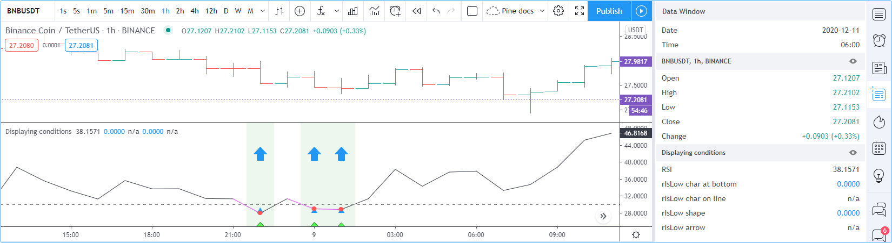

Debugging
=========

.. contents:: :local:
    :depth: 2

Introduction
------------

TradingView's close integration between the Pine Editor and charts allows for efficient and interactive debugging of Pine code. 
Once a Pine programmer understands the most appropriate technique to debug each type of situation, he will be able to debug quickly and thoroughly. 
This page demonstrates the most useful techniques to debug Pine code.

If you are not yet familiar with Pine's execution model, it is important that you read the :doc:`/language/Execution_model` page of this User Manual 
so you understand how your debugging code will behave in the Pine environment.

The lay of the land
-------------------

Values plotted by Pine scripts can be displayed in four distinct places:

#. Next to the script's name (controlled by the *Indicator Values* checkbox in the *Chart settings/Status Line* tab).
#. In the script's pane, whether your script is an overlay on the chart or in a separate pane.
#. In the scale (only displays the last bar's value and is controlled by the *Indicator Last Value Label* checkbox in the *Chart settings/Scale* tab).
#. In the Data Window (which you can bring up using the fourth icon down to the right of your chart).

.. image:: images/Debugging-TheLayOfTheLand-1.png

Note the following in the preceding screenshot:

- The chart's cursor is on the dataset's first bar, where ``bar_index`` is zero. That value is reflected next to the indicator's name and in the Data Window. 
  **Moving your cursor on other bars would update those values so they always represent the value of the plot on that bar.** 
  This is a good way to inspect the value of a variable as the script's execution progresses from bar to bar.
- The ``title`` argument of our `plot() <https://www.tradingview.com/pine-script-reference/v4/#fun_plot>`__ call, "Bar Index", is used as the value's legend in the Data Window.
- The precision of the values displayed in the Data Window is dependent on the chart symbol's tick value. You can modify it in two ways:
 
  - By changing the value of the *Precision* field in the script's *Settings/Style* tab. You can obtain up to eight digits of precision using this method.

  - By using the ``precision`` parameter in your script's `study() <https://www.tradingview.com/pine-script-reference/v4/#fun_study>`__ or `strategy() <https://www.tradingview.com/pine-script-reference/v4/#fun_strategy>`__ declaration statement. This method allows specifying up to 16 digits precision.

- The `plot() <https://www.tradingview.com/pine-script-reference/v4/#fun_plot>`__ call in our script plots the value of ``bar_index`` in the indicator's pane, 
  which shows the increasing value of the variable.
- The scale of the script's pane is automatically sized to accommodate the smallest and largest values plotted by all ``plot()`` calls in the script.

Displaying numeric values
-------------------------

When the script's scale is unimportant
^^^^^^^^^^^^^^^^^^^^^^^^^^^^^^^^^^^^^^

The script in the preceding screenshot used the simplest way to inspect numerical values: a ``plot()`` call, 
which plots a line corresponding to the variable's value in the script's display area. 
Our example script plotted the value of the `bar_index <https://www.tradingview.com/pine-script-reference/v4/#var_bar_index>`__ builtin variable, 
which contains the bar's number, a value beginning at zero on the dataset's first bar and increased by one on each 
subsequent bar. We used a ``plot()`` call to plot the variable to inspect because our script was not plotting anything else; 
we were not preoccupied with preserving the scale for other plots to continue to plot normally. This is the script we used::

    //@version=4
    study("Plot `bar_index`")
    plot(bar_index, "Bar Index")

When the script's scale must be preserved
^^^^^^^^^^^^^^^^^^^^^^^^^^^^^^^^^^^^^^^^^

Plotting values in the script's display area is not always possible. When we already have other plots going on and adding debugging plots of variables whose values fall outside the script's plotting boundaries would make the plots unreadable, another technique must be used to inspect values if we want to preserve the scale of the other plots.

Suppose we want to continue inspecting the value of ``bar_index``, but this time in a script where we are also plotting RSI::

    //@version=4
    study("Plot RSI and `bar_index`")
    r = rsi(close, 20)
    plot(r, "RSI", color.black)
    plot(bar_index, "Bar Index")

Running the script on a dataset containing a large number of bars yields the following display:

.. image:: images/Debugging-DisplayingNumericValues-1.png

where:

1. The RSI line in black is flat because it varies between zero and 100, but the indicator's pane is scaled to show the maximum value of ``bar_index``, which is ``25692.0000``.
2. The value of ``bar_index`` on the bar the cursor is on is displayed next to the indicator's name, and its blue plot in the script's pane is flat.
3. The ``25692.0000`` value of ``bar_index`` shown in the scale represents its value on the last bar, so the dataset contains 25693 bars.
4. The value of ``bar_index`` on the bar the cursor is on is also displayed in the Data Window, along with that bar's value for RSI just above it.

In order to preserve our plot of RSI while still being able to inspect the value or ``bar_index``, 
we will plot the variable using `plotchar() <https://www.tradingview.com/pine-script-reference/v4/#fun_plot>`__ like this::

    //@version=4
    study("Plot RSI and `bar_index`")
    r = rsi(close, 20)
    plot(r, "RSI", color.black)
    plotchar(bar_index, "Bar index", "", location.top)

.. image:: images/Debugging-DisplayingNumericValues-2.png

where:

- Because the value of ``bar_index`` is no longer being plotted in the script's pane, the pane's boundaries are now those of RSI, which displays normally.
- The value plotted using ``plotchar()`` is displayed next to the script's name and in the Data Window.
- We are not plotting a character with our ``plotchar()`` call, so the third argument is an empty string (``""``). 
  We are also specifying ``location.top`` as the ``location`` argument, so that we do not put the symbol's price in play in the calculation of the display area's boundaries.

Displaying strings
------------------

Pine labels must be used to display strings. Labels only appear in the script's display area; strings shown in labels will thus not appear in the Data Window or anywhere else.

Labels on each bar
^^^^^^^^^^^^^^^^^^

The following script demonstrates the simplest way to repetitively draw a label showing the symbol's name::

    //@version=4
    study("Simple label", "", true)
    label.new(bar_index, high, syminfo.ticker)

.. image:: images/Debugging-DisplayingStrings-1.png

By default, only the last 50 labels will be shown on the chart. You can increase this amount up to a maximum of 500 by using the ``max_labels_count`` parameter in your script's `study() <https://www.tradingview.com/pine-script-reference/v4/#fun_study>`__ or `strategy() <https://www.tradingview.com/pine-script-reference/v4/#fun_strategy>`__ declaration statement. For example::

    study("Simple label", "", true, max_labels_count = 500)

Labels on last bar
^^^^^^^^^^^^^^^^^^

As strings manipulated in Pine scripts often do not change bar to bar, the method most frequently used to visualize them is to draw a label on the dataset's last bar. 
Here, we use a function to create a more sophisticated label that only appears on the chart's last bar. Our ``f_print()`` function has only one parameter, the text string to be displayed::

    //@version=4
    study("f_print()", "", true)
    f_print(_text) =>
        // Create label on the first bar.
        var _label = label.new(bar_index, na, _text, xloc.bar_index, yloc.price, color(na), label.style_none, color.gray, size.large, text.align_left)
        // On next bars, update the label's x and y position, and the text it displays.
        label.set_xy(_label, bar_index, highest(10)[1])
        label.set_text(_label, _text)

    f_print("Multiplier = " + tostring(timeframe.multiplier) + "\nPeriod = " + timeframe.period + "\nHigh = " + tostring(high))
    f_print("Hello world!\n\n\n\n")

.. image:: images/Debugging-DisplayingStrings-2.png

Note the following in our last code example:

- We use the ``f_print()`` function to enclose the label-drawing code. While the function is called on each bar, 
  the label is only created on the dataset's first bar because of our use of the 
  `var <https://www.tradingview.com/pine-script-reference/v4/#op_var>`__ keyword when declaring the ``_label`` variable inside the function. After creating it, 
  we only update the label's *x* and *y* coordinates and its text on each successive bar. If we did not update those values, the label would remain on the dataset's first bar
  and would only display the text string's value on that bar. Lastly, note that we use ``highest(10)[1]`` to position the label vertically, 
  By using the highest high of the **previous** 10 bars, we prevent the label from moving during the realtime bar.

- We call the ``f_print()`` function twice to show that if you make multiple calls because it makes debugging multiple strings easier, 
  you can superimpose their text by using the correct amount of newlines (``\n``) to separate it.

- We use the `tostring() <https://www.tradingview.com/pine-script-reference/v4/#fun_tostring>`__ function to convert numeric values to a string for inclusion in the text to be displayed.

- You may need to change the *y* position where the label is drawn (``highest(10)[1]``) in certain conditions.

- We use AutoHotKey to speed coding up and have this line in our AHK script, which we use to bring up the ``f_print()`` function in our script when we need to debug strings.
  This is the AutoHotKey line that allows us to use ``CTRL-SHIT-P`` to insert the one-line version of the function in our code and create a call to the function 
  so all that's left to do is to type the string you want to display::

    ^+p:: SendInput f_print(_text) => var _label = label.new(bar_index, na, _text, xloc.bar_index, yloc.price, color(na), label.style_none, color.gray, size.large, text.align_left), label.set_xy(_label, bar_index, highest(10)[1]), label.set_text(_label, _text)`nf_print(){Left}

  AutoHotKey works only on Windows systems. Keyboard Maestro or others can be substituted on Apple systems.

Debugging conditions
--------------------

Single conditions
^^^^^^^^^^^^^^^^^

Many methods can be used to display occurrences where a condition is met. This code shows six ways to identify bars where RSI is smaller than 30::

    //@version=4
    study("Single conditions")
    r = rsi(close, 20)
    rIsLow = r < 30
    hline(30)

    // Method #1: Change the plot's color.
    plot(r, "RSI", rIsLow ? color.fuchsia : color.black)
    // Method #2: Plot a character in the bottom region of the display.
    plotchar(rIsLow, "rIsLow char at bottom", "▲", location.bottom, size = size.small)
    // Method #3: Plot a character on the RSI line.
    plotchar(rIsLow ? r : na, "rIsLow char on line", "•", location.absolute, color.red, size = size.small)
    // Method #4: Plot a shape in the top region of the display.
    plotshape(rIsLow, "rIsLow shape", shape.arrowup, location.top)
    // Method #5: Plot an arrow.
    plotarrow(rIsLow ? 1 : na, "rIsLow arrow")
    // Method #6: Change the background's color.
    bgcolor(rIsLow ? color.green : na)

Note that:

- We define our condition in the ``rIsLow`` boolean variable and it is evaluated on each bar. The ``r < 30`` expression used to assign a value to the variable evaluates to ``true`` or ``false`` (or ``na`` when ``r`` is ``na``, as is the case in the first bars of the dataset).
- **Method #1** uses a change in the color of the RSI plot on the condition. Whenever a plot's color changes, it colors the plot starting from the preceding bar.
- **Method #2** uses ``plotchar()`` to plot an up triangle in the bottom part of the indicator's display. 
  Using different combinations of positions and characters allows the simultaneous identification of many different conditions on a single bar.
  This is one of our preferred methods for identifying areas of interest on the chart.
- **Method #3** also uses a ``plotchar()`` call, but this time the character's is positioned on the RSI line. 
  In order to achieve this, we use ``location.absolute`` argument and use Pine's ternary conditional operator (``?``) to define a conditional expression 
  where a *y* position is used only when our ``rIsLow`` condition is true. When it is not true, ``na`` is used, so no character is displayed.
- **Method #4** uses ``plotshape()`` to plot a blue up arrow in the top part of the indicator's display area when our condition is met.
- **Method #5** uses ``plotarrow()`` to plot a green up arrow at the bottom of the display when our condition is met.
- **Method #6** uses ``bgcolor`` to change the color of the background when our condition is met. The ternary operator is used once again to evaluate our condition. 
  It will return ``color.green`` when ``rIsLow`` is true, and the ``na`` color (which does not color the background) when ``rIsLow`` is false or ``na``.
- Lastly, note how a boolean variable with a ``true`` value displays as ``1`` in the Data Window. ``false`` values are denoted by a zero value.

Compound conditions
^^^^^^^^^^^^^^^^^^^

Programmers needing to identify situations where more than one condition is met need to build compound conditions by aggregating individual conditions using the `and <https://www.tradingview.com/pine-script-reference/v4/#op_and>`__ logical operator. You will save yourself many headaches if you validate that each individual condition triggers when you expect before using the compound condition in your code. The state of multiple individual conditions can be displayed using a technique like this one, where four individual conditions make up our compound condition::

    //@version=4
    study("Compound conditions")
    i_period    = input(20)
    i_bullLevel = input(55)

    r = rsi(close, i_period)

    // Condition #1.
    rsiBull = r > i_bullLevel
    // Condition #2.
    hiChannel = highest(r, i_period * 2)[1]
    aboveHiChannel = r > hiChannel
    // Condition #3.
    channelIsOld = hiChannel >= hiChannel[i_period]
    // Condition #4.
    historyIsBull = sum(rsiBull ? 1 : -1, i_period * 3) > 0
    // Compound condition.
    bull = rsiBull and aboveHiChannel and channelIsOld and historyIsBull

    hline(i_bullLevel)
    plot(r, "RSI", color.black)
    plot(hiChannel, "High Channel")

    plotchar(rsiBull ? i_bullLevel : na, "rIsBull", "1", location.absolute, color.green, size = size.tiny)
    plotchar(aboveHiChannel ? r : na, "aboveHiChannel", "2", location.absolute, size = size.tiny)
    plotchar(channelIsOld, "channelIsOld", "3", location.bottom, size = size.tiny)
    plotchar(historyIsBull, "historyIsBull", "4", location.top, size = size.tiny)
    bgcolor(bull ? not bull[1] ? color.new(color.green, 50) : color.green : na)

.. image:: images/Debugging-DisplayingConditions-2.png

Note that:

- We use a ``plotchar()`` call to display each condition's number, taking care to spread them over the indicator's *y* space so they don't overlap.
- The first two ``plotchar()`` calls use absolute positioning to place the condition number so that it helps us remember the corresponding condition. 
  The first one which displays "1" when RSI is higher than the user-defined bull level for example, positions the "1" on the bull level.
- We use two different shades of green to color the background: the brighter one indicates the first bar where our compound condition becomes ``true``, 
  the lighter green identifies subsequent bars where our compound condition continues to be true.
- While it is not always strictly necessary to assign individual conditions to a variable because they can be used directly in boolean expressions, 
  it makes for more readable code when you assign the condition to a variable name that will remind you and your readers of the condition. 
  Readability considerations should always prevail in cases like this one, where the hit on performance is minimal or null.

Debugging from inside functions
-------------------------------

Suppose we are using a function such as ``f_hlca()`` in this script::

    //@version=4
    study("Debugging from inside functions", "", true)
    f_hlca() =>
        var float _avg = na
        _hlca = avg(high, low, close, nz(_avg, close))
        _avg := sma(_hlca, 20)

    hlca = f_hlca()
    plot(hlca)

and we need to inspect the value of ``_hlca`` as the function calculates it, bar to bar, while still being able to use the function's result. 
We cannot access the ``_hlca`` variable used inside the function from the script's global scope. 
We thus need another mechanism to pull that variable's value from inside the function's local scope.
We can use Pine's ability to have functions return a tuple to gain access to the variable::

    //@version=4
    study("Debugging from inside functions", "", true)
    f_hlca() =>
        var float _avg = na
        _instantVal = avg(high, low, close, nz(_avg, close))
        _avg := sma(_instantVal, 20)
        // Return two values instead of one.
        [_avg, _instantVal]

    [hlca, instantVal] = f_hlca()
    plot(hlca, "hlca")
    plot(instantVal, "instantVal", color.black)

.. image:: images/Debugging-DebuggingFromInsideFunctions-1.png

Contrary to global scope variables, array elements of globally defined arrays can be modified from within functions. 
We could use this feature to write a functionally equivalent script::

    //@version=4
    study("Debugging from inside functions", "", true)
    // Create an array containing only one float element.
    instantVal = array.new_float(1)
    f_hlca() =>
        var float _avg = na
        _instantVal = avg(high, low, close, nz(_avg, close))
        // Set the array's only element to the current value of `_instantVal`.
        array.set(instantVal, 0, _instantVal)
        _avg := sma(_instantVal, 20)

    hlca = f_hlca()
    plot(hlca, "hlca")
    // Retrieve the value of the array's only element which was set from inside the function.
    plot(array.get(instantVal, 0), "instantVal", color.black)

Debugging from inside 'for' loops
---------------------------------

Values inside `for <https://www.tradingview.com/pine-script-reference/v4/#op_for>`__ loops cannot be plotted using ``plot()`` calls. Here, we explore three different techniques to inspect variable values originating from ``for`` loops, starting from this code example, which calculates the balance of bars in the lookback period which have a higher/lower true range value than the current bar::

    //@version=4
    study("Debugging from inside `for` loops")
    i_lookBack = input(20, minval = 0)

    float lowerRangeBalance = 0
    for _i = 1 to i_lookBack
        lowerRangeBalance := lowerRangeBalance + sign(tr - tr[_i])

    hline(0)
    plot(lowerRangeBalance)

Extracting a single value
^^^^^^^^^^^^^^^^^^^^^^^^^

If we want to inspect the value of a variable at a single point in the loop, we can save it and plot it once the loop is exited. Here, we save the value of ``tr`` in the ``val`` variable at the loop's last iteration::

    //@version=4
    study("Debugging from inside `for` loops", max_lines_count = 500, max_labels_count = 500)
    i_lookBack = input(20, minval = 0)

    float val = na
    float lowerRangeBalance = 0
    for _i = 1 to i_lookBack
        lowerRangeBalance := lowerRangeBalance + sign(tr - tr[_i])
        if _i == i_lookBack
            val := tr[_i]
    hline(0)
    plot(lowerRangeBalance)
    plot(val, "val", color.black)

.. image:: images/Debugging-DebuggingFromInsideForLoops-1.png

Using lines and labels
^^^^^^^^^^^^^^^^^^^^^^

Here we use lines and labels to display a line and corresponding loop index and ``tr`` value for each loop iteration. This gives us a general idea of the values being used in each loop iteration::

    //@version=4
    study("Debugging from inside `for` loops", max_lines_count = 500, max_labels_count = 500)
    i_lookBack = input(20, minval = 0)

    float lowerRangeBalance = 0
    for _i = 1 to i_lookBack
        lowerRangeBalance := lowerRangeBalance + sign(tr - tr[_i])
        line.new(bar_index[1], tr[_i], bar_index, tr[_i], color = color.black)
        label.new(bar_index, tr[_i], tostring(_i) + "•" + tostring(tr[_i]), style = label.style_none, size = size.small)

    hline(0)
    plot(lowerRangeBalance)

.. image:: images/Debugging-DebuggingFromInsideForLoops-2.png

Note that:

- The scale in the preceeding screenshot has been manually expanded to show more detail by clicking and dragging the scale area.
- We have used ``max_lines_count = 500, max_labels_count = 500`` in our ``study()`` declaration statement to display the maximum number of lines and labels.
- We could use the same technique while isolating a specific loop iteration as we did in the preceding example, to show only one level.

