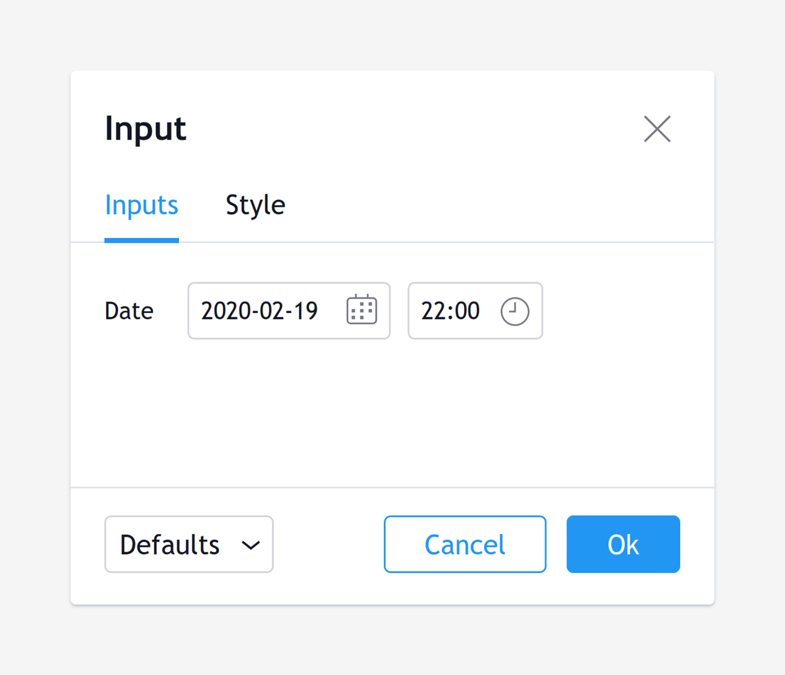

Script inputs
-------------

The `input() <https://www.tradingview.com/pine-script-reference/v5/#fun_input>`__
annotation function and other ``input.*()`` functions (``input.int()``, ``input.string()``, etc) make it possible for script users to modify selected
values which the script can then use in its calculation or logic,
without the need to modify the script's code.

Specific widgets are supplied in the *Settings/Inputs* dialog box
for each type of input. A description of the value as well as minimum/maximum
values and a step increment can also be defined for many input types. The type of the variable can be explicitly defined using the relevant ``input.*()`` function, or a general purpose ``input()`` function can be used to automatically assign a type based on the default value. Only basic types (``int``, ``float``, ``bool``, ``string``, and ``color``) can be assigned that way.

Pine supports the following types of input:

-  input.bool(),
-  input.color(),
-  input.int(),
-  input.float(),
-  input.string(),
-  input.symbol(),
-  input.timeframe(),
-  input.session(),
-  input.source(),
-  input.time().

The following examples show how to create each type of input and what
its widget looks like.

Boolean input
^^^^^^^^^^^^^
::

    b = input.bool(title="On/Off", defval=true)
    plot(b ? open : na)

.. figure:: images/Inputs_of_indicator_1.png

Color input
^^^^^^^^^^^
::

    c = input.color(title="Color", defval=color.red)
    plot(close, color=c)

.. figure:: images/Inputs_of_indicator_8.png

Integer input
^^^^^^^^^^^^^
::

    i = input.int(title="Offset", defval=7, minval=-10, maxval=10)
    plot(close[i])

.. figure:: images/Inputs_of_indicator_2.png

Float input
^^^^^^^^^^^
::

    f = input.float(title="Angle", defval=-0.5, minval=-3.14, maxval=3.14, step=0.2)
    plot(sin(f) > 0 ? close : open)

.. figure:: images/Inputs_of_indicator_3.png

Symbol and resolution inputs
^^^^^^^^^^^^^^^^^^^^^^^^^^^^
::

    sym = input.symbol(title="Symbol", defval="SPY")
    res = input.timeframe(title="Timeframe", defval="60")
    plot(close, color=color.red)
    plot(request.security(sym, res, close), color=color.green)

.. figure:: images/Inputs_of_indicator_4.png

The symbol input widget has a built-in *symbol search* which activates
automatically when the ticker's first characters are typed.

Session input
^^^^^^^^^^^^^
::

    s = input.session(title="Session", defval="24x7")
    plot(time(timeframe.period, s))

.. figure:: images/Inputs_of_indicator_5.png

Source input
^^^^^^^^^^^^^
::

    src = input.source(title="Source", defval=close)
    ma = ta.sma(src, 9)
    plot(ma)

.. figure:: images/Inputs_of_indicator_6.png

Time input
^^^^^^^^^^^^^
::

    date = input.time(title="Date", defval=timestamp("20 Feb 2020 00:00 +0300"))
    plot(date)

options parameter
^^^^^^^^^^^^^^^^^
The ``options`` parameter is useful to provide users with a list
of constant values they can choose from using a dropdown menu.
::

    choice = input.string(title="Choice", defval="A", options=["A", "B"])
    plot(choice == "A" ? close : choice == "B" ? open : na)
	
.. figure:: images/Inputs_of_indicator_7.png

