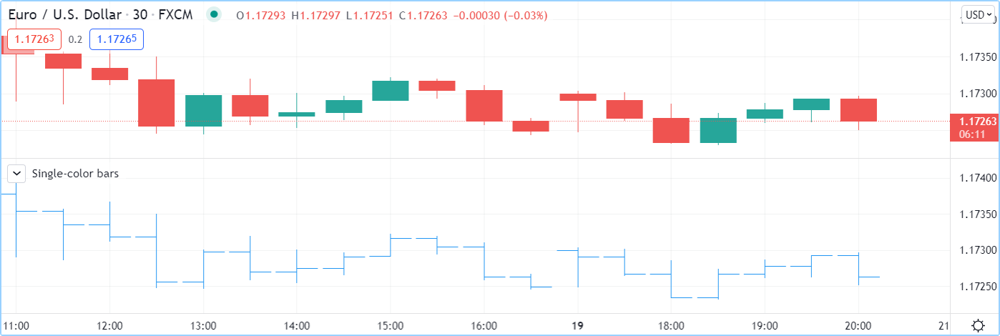

.. _PageBarPlotting:

Bar plotting
============

.. contents:: :local:
    :depth: 2

Introduction
------------

The `plotcandle() <https://www.tradingview.com/pine-script-reference/v5/#fun_plotcandle>`__ 
built-in function is used to plot candles.
`plotbar() <https://www.tradingview.com/pine-script-reference/v5/#fun_plotbar>`__
is used to plot conventional bars.

Both functions require four arguments that will be used for the OHLC prices
(`open <https://www.tradingview.com/pine-script-reference/v5/#var_open>`__,
`high <https://www.tradingview.com/pine-script-reference/v5/#var_high>`__,
`low <https://www.tradingview.com/pine-script-reference/v5/#var_low>`__,
`close <https://www.tradingview.com/pine-script-reference/v5/#var_close>`__)
of the bars they will be plotting. 
If one of those is `na <https://www.tradingview.com/pine-script-reference/v5/#var_na>`__, no bar is plotted.

Plotting candles with \`plotcandle()\`
--------------------------------------

The signature of `plotcandle() <https://www.tradingview.com/pine-script-reference/v5/#fun_plotcandle>`__ is::

    plotcandle(open, high, low, close, title, color, wickcolor, editable, show_last, bordercolor, display) → void

This plots simple candles, all in blue, using the habitual OHLC values, in a separate pane::

    //@version=5
    indicator("Single-color candles")
    plotcandle(open, high, low, close)

.. image:: images/BarPlotting-Plotcandle-1.png

To color them green or red, we can use the following code::

    //@version=5
    indicator("Example 2")
    paletteColor = close >= open ? color.lime : color.red
    plotbar(open, high, low, close, color = paletteColor)

.. image:: images/BarPlotting-Plotcandle-2.png

Note that the ``color`` parameter accepts "series color" arguments, 
so constant values such as ``color.red``, ``color.lime``, ``"#FF9090"``, 
as well as expressions that calculate colors at runtime, 
as is done with the ``paletteColor`` variable here, will all work.

You can build bars or candles using values other than the actual OHLC values.
For example you could calculate and plot *smoothed* candles using the following code::

    //@version=5
    indicator("Smoothed candles", overlay = true)
    lenInput = input.int(9)
    smooth(source, length) =>
        ta.sma(source, length)
    o = smooth(open, lenInput)
    h = smooth(high, lenInput)
    l = smooth(low, lenInput)
    c = smooth(close, lenInput)
    ourWickColor = close > c ? color.green : color.red
    plotcandle(o, h, l, c, wickcolor = ourWickColor)

.. image:: images/BarPlotting-Plotcandle-3.png

You may find it useful to plot OHLC values taken from a
higher timeframe. You can, for example, plot daily bars on an intraday chart::

    // NOTE: Use this script on an intraday chart.
    //@version=5
    indicator("HTF bars")
    
    string higherTFInput = input.timeframe("D")
    
    // Use gaps to only return data when the HTF completes, `na` otherwise.
    [o, h, l, c] = request.security(syminfo.tickerid, higherTFInput, [open, high, low, close], gaps = barmerge.gaps_on)
    
    var color UP_COLOR = color.silver
    var color DN_COLOR = color.blue
    color wickColor = c >= o ? UP_COLOR : DN_COLOR
    color bodyColor = c >= o ? color.new(UP_COLOR, 70) : color.new(DN_COLOR, 70)
    // Only plot candles on intraday timeframes, 
    // and when non `na` values are returned by `request.security()` because a HTF has completed.
    plotcandle(timeframe.isintraday ? o : na, h, l, c, color = bodyColor, wickcolor = wickColor)

.. image:: images/BarPlotting-Plotcandle-4.png

Note that:

- The script will only display candles when two conditions are met:
     - The chart's is an intraday chart (see the check on ``timeframe.isintraday`` in the
       `plotcandle() <https://www.tradingview.com/pine-script-reference/v5/#fun_plotcandle>`__ call.
     - The `request.security() <https://www.tradingview.com/pine-script-reference/v5/#fun_request{dot}security>`__
       returns non `na <https://www.tradingview.com/pine-script-reference/v5/#var_na>`__ values
       (see ``gaps = barmerge.gaps_on`` in the function call).
- We use `var <https://www.tradingview.com/pine-script-reference/v5/#op_var>`__ to declare our
  ``UP_COLOR`` and ``DN_COLOR`` color constants on the bar zero only. We use constants because those colors are used
  in more than one place in our code. This way, if we need to change them, we need only do so in one place.
- We create a lighter transparency for the body of our candles in the ``bodyColor`` variable initialization, so they don't obstruct the chart's candles.
- We creat the ``isNewBar()`` function to detect when the higher

Plotting bars with \`plotbar()\`
--------------------------------

The signature of `plotbar() <https://www.tradingview.com/pine-script-reference/v5/#fun_plotbar>`__ is::

    plotbar(open, high, low, close, title, color, editable, show_last, display) → void

This plots simple bars using the habitual OHLC values in a separate pane::

    //@version=5
    indicator("Single-color bars")
    plotbar(open, high, low, close, "OHLC bars")

To color them green or red, we can use the following code::

    //@version=5
    indicator("Example 2")
    paletteColor = close >= open ? color.lime : color.red
    plotbar(open, high, low, close, color = paletteColor)

.. image:: images/BarPlotting-Plotbar-3.png

Note that:

- The ``color`` parameter accepts "series color" arguments, so constant values such as ``color.red``, ``color.lime``, ``"#FF9090"``, 
  as well as expressions that calculate colors at runtime, as is done with the ``paletteColor`` variable here, will all work.

The ``plotcandle`` annotation function is similar to ``plotbar``, but it plots candles
instead of bars and has an optional argument: ``wickcolor``.

Both ``plotbar`` and ``plotcandle`` need four series as the arguments that will be
used for new bar/candle OHLC prices. If one of
the arguments for a bar has a ``na`` value, then the bar is not
plotted. Example::

    //@version=5
    indicator("Example 3")
    c = close > open ? na : close
    plotcandle(open, high, low, c)

.. image:: images/Custom_ohlc_bars_and_candles_3.png

You can build bars or candles using values other than the actual OHLC values.
For example you could calculate and plot *smoothed* candles using the following code::

    //@version=5
    indicator("Example 4")
    lenInput = input.int(9)
    smooth(source, length) =>
        ta.sma(source, length)
    o = smooth(open, lenInput)
    h = smooth(high, lenInput)
    l = smooth(low, lenInput)
    c = smooth(close, lenInput)
    plotcandle(o, h, l, c)

.. image:: images/Custom_ohlc_bars_and_candles_4.png

You may find it useful to plot OHLC values taken from a
higher timeframe. You can, for example, plot daily bars on a *60 minutes* chart::

    // NOTE: add this script on intraday chart
    //@version=5
    indicator("Example 5")
    higherTFInput = input.timeframe("D")
    isNewBar(res) =>
        nz(ta.change(time(res)) > 0, true)
    [o, h, l, c] = request.security(syminfo.tickerid, higherTFInput, [open, high, low, close])
    plotbar(isNewBar(higherTFInput) ? o : na, h, l, c, color=c >= o ? color.lime : color.red)

.. image:: images/Custom_ohlc_bars_and_candles_5.png

The ``plotbar`` and ``plotcandle`` annotation functions also have a ``title`` argument, so users can distinguish them in
the *Style* tab of the *Settings* dialog box.
