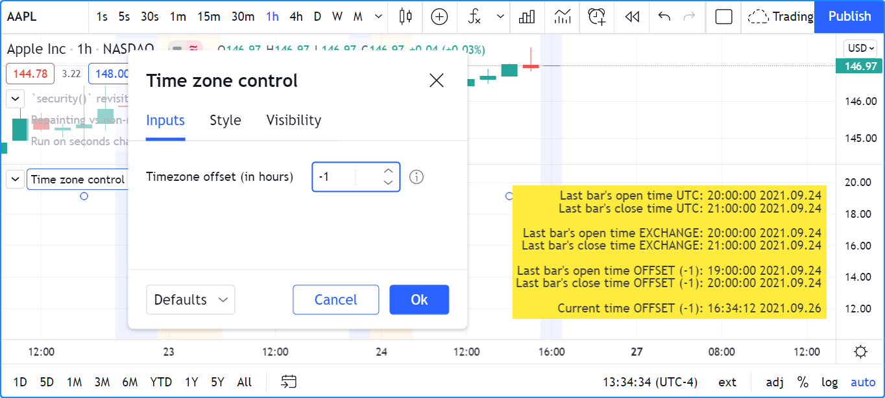
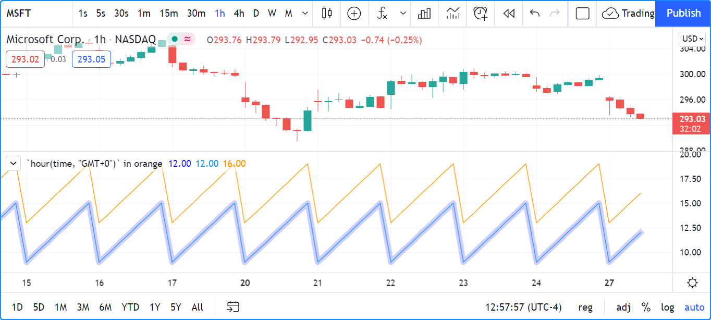
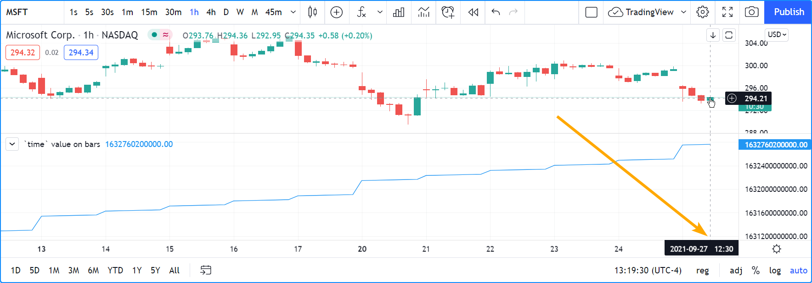
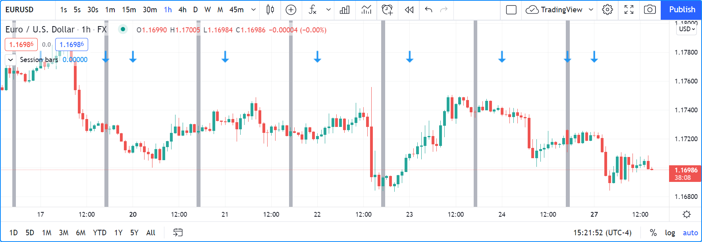

.. _PageTime:

.. image:: /images/Pine_Script_logo.svg
   :alt: Pine Script™ logo
   :target: https://www.tradingview.com/pine-script-docs/en/v5/Introduction.html
   :align: right
   :width: 100
   :height: 100

Time
====

.. contents:: :local:
    :depth: 3

Introduction
------------

Four references
^^^^^^^^^^^^^^^

Four different references come into play when using date and time values in Pine Script™:

#. **UTC**: The native format for time values in Pine Script™ is the **Unix time in milliseconds**. 
   Unix time is the time elapsed since the **Unix Epoch on January 1st, 1970 at UTC**.
   See here for the `current Unix time in seconds <https://www.unixtimestamp.com/>`__
   and here for more information on `Unix Time <https://en.wikipedia.org/wiki/Unix_time>`__.
   A value for the Unix time is called a *timestamp*.
   Unix timestamps are always expressed in the UTC (or "GMT", or "GMT+0") time zone.
   They are measured from a fixed reference, i.e., the Unix Epoch, and do not vary with time zones.
   Some Pine Script™ built-ins use the UTC time zone as a reference.
#. **Exchange time zone**: A second time-related key reference for traders is the time zone of the exchange where an instrument is traded.
   Some built-ins like `hour <https://www.tradingview.com/pine-script-reference/v5/#var_hour>`__
   return values in the exchange's time zone.
#. ``timezone`` parameter: Some functions that normally return values in the exchange's time zone,
   such as `hour() <https://www.tradingview.com/pine-script-reference/v5/#fun_hour>`__
   include a ``timezone`` parameter that allows you to adapt the function's result to another time zone.
   Other functions like `time() <https://www.tradingview.com/pine-script-reference/v5/#fun_time>`__
   include both ``session`` and ``timezone`` parameters. In those cases, the ``timezone`` arguments
   applies to how the ``session`` argument is interpreted — not to the time value returned by the function.
#. **Chart's time zone**: This is the time zone chosen by the user from the chart using the "Chart Settings/Symbol/Time Zone" field.
   This setting only affects the display of dates and times on the chart. 
   It does not affect the behavior of Pine scripts, and they have no visiblity over this setting.

We will note, when discussing variables or functions, if they return dates or times in UTC or exchange time zone.
Scripts do not have visibility on the user's time zone setting on his chart.

Time built-ins
^^^^^^^^^^^^^^

Pine Script™ has built-in **variables** to:

- Get timestamp information from the current bar (UTC time zone): 
  `time <https://www.tradingview.com/pine-script-reference/v5/#var_time>`__ and
  `time_close <https://www.tradingview.com/pine-script-reference/v5/#var_time_close>`__
- Get timestamp information for the beginning of the current trading day (UTC time zone):
  `time_tradingday <https://www.tradingview.com/pine-script-reference/v5/#var_time_tradingday>`__
- Get the current time in one-second increments (UTC time zone):
  `timenow <https://www.tradingview.com/pine-script-reference/v5/#var_timenow>`__
- Retrieve calendar and time values from the bar (exchange time zone):
  `year <https://www.tradingview.com/pine-script-reference/v5/#var_year>`__,
  `month <https://www.tradingview.com/pine-script-reference/v5/#var_month>`__,
  `weekofyear <https://www.tradingview.com/pine-script-reference/v5/#var_weekofyear>`__,
  `dayofmonth <https://www.tradingview.com/pine-script-reference/v5/#var_dayofmonth>`__,
  `dayofweek <https://www.tradingview.com/pine-script-reference/v5/#var_dayofweek>`__,
  `hour <https://www.tradingview.com/pine-script-reference/v5/#var_hour>`__,
  `minute <https://www.tradingview.com/pine-script-reference/v5/#var_minute>`__ and
  `second <https://www.tradingview.com/pine-script-reference/v5/#var_second>`__
- Return the time zone of the exchange of the chart's symbol with
  `syminfo.timezone <https://www.tradingview.com/pine-script-reference/v5/#var_syminfo{dot}timezone>`__

There are also built-in **functions** that can:

- Return timestamps of bars from other timeframes
  with `time() <https://www.tradingview.com/pine-script-reference/v5/#fun_time>`__ and
  `time_close() <https://www.tradingview.com/pine-script-reference/v5/#fun_time_close>`__,
  without the need for a `request.security() <https://www.tradingview.com/pine-script-reference/v5/#fun_request{dot}security>`__ call
- Retrieve calendar and time values from any timestamp, which can be offset with a time zone:
  `year() <https://www.tradingview.com/pine-script-reference/v5/#fun_year>`__,
  `month() <https://www.tradingview.com/pine-script-reference/v5/#fun_month>`__,
  `weekofyear() <https://www.tradingview.com/pine-script-reference/v5/#fun_weekofyear>`__,
  `dayofmonth() <https://www.tradingview.com/pine-script-reference/v5/#fun_dayofmonth>`__,
  `dayofweek() <https://www.tradingview.com/pine-script-reference/v5/#fun_dayofweek>`__,
  `hour() <https://www.tradingview.com/pine-script-reference/v5/#fun_hour>`__,
  `minute() <https://www.tradingview.com/pine-script-reference/v5/#fun_minute>`__ and
  `second() <https://www.tradingview.com/pine-script-reference/v5/#fun_second>`__
- Create a timestamp using `timestamp() <https://www.tradingview.com/pine-script-reference/v5/#fun_timestamp>`__
- Convert a timestamp to a formatted date/time string for display, 
  using `str.format() <https://www.tradingview.com/pine-script-reference/v5/#fun_str{dot}format>`__
- Input data and time values. See the section on :ref:`Inputs <PageInputs>`.
- Work with :ref:`session information <PageSessions>`.

Time zones
^^^^^^^^^^

TradingViewers can change the time zone used to display bar times on their charts.
Pine scripts have no visiblity over this setting.
While there is a `syminfo.timezone <https://www.tradingview.com/pine-script-reference/v5/#var_syminfo{dot}timezone>`__
variable to return the time zone of the exchange where the chart's instrument is traded,
there is **no** ``chart.timezone`` equivalent.

When displaying times on the chart, this shows one way of providing users a way of adjusting your script's time values to those of their chart.
This way, your displayed times can match the time zone used by traders on their chart:

::

    //@version=5
    indicator("Time zone control")
    MS_IN_1H = 1000 * 60 * 60
    TOOLTIP01 = "Enter your time zone's offset (+ or −), including a decimal fraction if needed."
    hoursOffsetInput = input.float(0.0, "Timezone offset (in hours)", minval = -12.0, maxval = 14.0, step = 0.5, tooltip = TOOLTIP01)
    
    printTable(txt) => 
        var table t = table.new(position.middle_right, 1, 1)
        table.cell(t, 0, 0, txt, text_halign = text.align_right, bgcolor = color.yellow)
    
    msOffsetInput = hoursOffsetInput * MS_IN_1H
    printTable(
      str.format("Last bar''s open time UTC: {0,date,HH:mm:ss yyyy.MM.dd}", time) +
      str.format("\nLast bar''s close time UTC: {0,date,HH:mm:ss yyyy.MM.dd}", time_close) +
      str.format("\n\nLast bar''s open time EXCHANGE: {0,date,HH:mm:ss yyyy.MM.dd}", time(timeframe.period, syminfo.session, syminfo.timezone)) +
      str.format("\nLast bar''s close time EXCHANGE: {0,date,HH:mm:ss yyyy.MM.dd}", time_close(timeframe.period, syminfo.session, syminfo.timezone)) +
      str.format("\n\nLast bar''s open time OFFSET ({0}): {1,date,HH:mm:ss yyyy.MM.dd}", hoursOffsetInput, time + msOffsetInput) +
      str.format("\nLast bar''s close time OFFSET ({0}): {1,date,HH:mm:ss yyyy.MM.dd}", hoursOffsetInput, time_close + msOffsetInput) +
      str.format("\n\nCurrent time OFFSET ({0}): {1,date,HH:mm:ss yyyy.MM.dd}", hoursOffsetInput, timenow + msOffsetInput))

Note that:

- We convert the user offset expressed in hours to milliseconds with ``msOffsetInput``.
  We then add that offset to a timstamp in UTC format before converting it to display format, e.g., ``time + msOffsetInput`` and ``timenow + msOffsetInput``.
- We use a tooltip to provide instructions to users.
- We provide ``minval`` and ``maxval`` values to protect the input field, 
  and a ``step`` value of 0.5 so that when they use the field's up/down arrows, they can intuitively figure out that fractions can be used.
- The `str.format() <https://www.tradingview.com/pine-script-reference/v5/#fun_str{dot}format>`__
  function formats our time values, namely the last bar's time and the current time.

Some functions that normally return values in the exchange's time zone provide means to adapt their result to another time zone through the ``timezone`` parameter.
This script illustrates how to do this with `hour() <https://www.tradingview.com/pine-script-reference/v5/#fun_hour>`__:

::

    //@version=5
    indicator('`hour(time, "GMT+0")` in orange')
    color BLUE_LIGHT = #0000FF30
    plot(hour, "", BLUE_LIGHT, 8)
    plot(hour(time, syminfo.timezone))
    plot(hour(time, "GMT+0"),"UTC", color.orange)

Note that:

- The `hour <https://www.tradingview.com/pine-script-reference/v5/#var_hour>`__ variable and the 
  `hour() <https://www.tradingview.com/pine-script-reference/v5/#fun_hour>`__ function normally returns a value in the exchange's time zone.
  Accordingly, plots in blue for both ``hour`` and ``hour(time, syminfo.timezone)`` overlap.
  Using the function form with ``syminfo.timezone`` is thus redundant if the exchange's hour is what's required.
- The orange line plotting ``hour(time, "GMT+0")``, however, returns the bar's hour at UTC, or "GMT+0" time,
  which in this case is four hours less than the exchange's time, since MSFT trades on the NASDAQ whose time zone is UTC-4.

.. _PageTime_TimeZoneStrings:

Time zone strings
"""""""""""""""""

The argument used for the ``timezone`` parameter in functions such as 
`time() <https://www.tradingview.com/pine-script-reference/v5/#fun_time>`__,
`timestamp() <https://www.tradingview.com/pine-script-reference/v5/#fun_timestamp>`__,
`hour() <https://www.tradingview.com/pine-script-reference/v5/#fun_hour>`__, etc., can be in different formats,
which you can find in the `IANA time zone database name <https://en.wikipedia.org/wiki/List_of_tz_database_time_zones>`__ reference page.
Contents from the "TZ database name", "UTC offset ±hh:mm" and "UTC DST offset ±hh:mm" columns of that page's table can be used.

To express an offset of +5.5 hours from UTC, these strings found in the reference page are all equivalent:

- ``"GMT+05:30"``
- ``"Asia/Calcutta"``
- ``"Asia/Colombo"``
- ``"Asia/Kolkata"``

Non-fractional offsets can be expressed in the ``"GMT+5"`` form. ``"GMT+5.5"`` is not allowed.

Time variables
--------------

\`time\` and \`time_close\`
^^^^^^^^^^^^^^^^^^^^^^^^^^^

Let's start by plotting `time <https://www.tradingview.com/pine-script-reference/v5/#var_time>`__ and
`time_close <https://www.tradingview.com/pine-script-reference/v5/#var_time_close>`__,
the Unix timestamp in milliseconds of the bar's opening and closing time:

::

    //@version=5
    indicator("`time` and `time_close` values on bars")
    plot(time, "`time`")
    plot(time_close, "`time_close`")

Note that:

- The `time <https://www.tradingview.com/pine-script-reference/v5/#var_time>`__ and
  `time_close <https://www.tradingview.com/pine-script-reference/v5/#var_time_close>`__ variables
  returns a timestamp in `UNIX time <https://en.wikipedia.org/wiki/Unix_time>`__, which is independent of the timezone selected by the user on his chart.
  In this case, the **chart's** time zone setting is the exchange time zone, so whatever symbol is on the chart, 
  its exchange time zone will be used for the display of the date and time values on the chart's cursor.
  The NASDAQ's time zone is UTC-4, but this only affects the chart's display of date/time values; it has no impact on the
  values plotted by the script.
- The last `time <https://www.tradingview.com/pine-script-reference/v5/#var_time>`__
  value for the plot shown in the scale is the number of milliseconds elapsed from 00:00:00 UTC, 1 January, 1970, until the bar's opening time.
  It corresponds to 17:30 on the 27th of September 2021. However, because the chart is using the UTC-4 time zone (the NASDAQ's time zone),
  it is displaying the 13:30 time, four hours earlier than UTC time.
- The difference between the two values on the last bar is the number of milliseconds in one hour (1000 * 60 * 60 = 3,600,000)
  because we are on a 1H chart.

\`time_tradingday\`
^^^^^^^^^^^^^^^^^^^^^

`time_tradingday <https://www.tradingview.com/pine-script-reference/v5/#var_time_tradingday>`__ is useful
when a symbol trades on overnight sessions that start and close on different calendar days.
This happens in forex markets, for example, where a session can open Sunday at 17:00 and close Monday at 17:00.

The variable returns the time of the beginning of the trading day when used at timeframes of 1D and less.
When used on timeframes higher than 1D, 
it returns the starting time of the last trading day in the bar (e.g., at 1W it will return the starting time of the last trading day of the week).

\`timenow\`
^^^^^^^^^^^

`timenow <https://www.tradingview.com/pine-script-reference/v5/#var_timenow>`__ returns the current time.
It works in realtime, but also when a script executes on historical bars. 
In realtime, your scripts will only perceive changes when they execute on feed updates.
When no updates occur the script is idle, so it cannot update its display.
See the page on Pine Script™'s :ref:`execution model <PageExecutionModel>` for more information.

This script uses the values of `timenow <https://www.tradingview.com/pine-script-reference/v5/#var_timenow>`__
and `time_close <https://www.tradingview.com/pine-script-reference/v5/#var_time_close>`__
to calculate a realtime countdown for intraday bars.
Contrary to the countdown on the chart, this one will only update when a feed update causes the script to execute another iteration::

    //@version=5
    indicator("", "", true)
    
    printTable(txt) => 
        var table t = table.new(position.middle_right, 1, 1)
        table.cell(t, 0, 0, txt, text_halign = text.align_right, bgcolor = color.yellow)
    
    printTable(str.format("{0,time,HH:mm:ss.SSS}", time_close - timenow))

Calendar dates and times
^^^^^^^^^^^^^^^^^^^^^^^^

Calendar date and time variables such as
`year <https://www.tradingview.com/pine-script-reference/v5/#var_year>`__,
`month <https://www.tradingview.com/pine-script-reference/v5/#var_month>`__,
`weekofyear <https://www.tradingview.com/pine-script-reference/v5/#var_weekofyear>`__,
`dayofmonth <https://www.tradingview.com/pine-script-reference/v5/#var_dayofmonth>`__,
`dayofweek <https://www.tradingview.com/pine-script-reference/v5/#var_dayofweek>`__,
`hour <https://www.tradingview.com/pine-script-reference/v5/#var_hour>`__,
`minute <https://www.tradingview.com/pine-script-reference/v5/#var_minute>`__ and
`second <https://www.tradingview.com/pine-script-reference/v5/#var_second>`__
can be useful to test for specific dates or times, and as arguments to 
`timestamp() <https://www.tradingview.com/pine-script-reference/v5/#fun_timestamp>`__.

When testing for specific dates or times, ones needs to account for the possibility that the script will be executing on timeframes
where the tested condition cannot be detected, or for cases where a bar with the specific requirement will not exist.
Suppose, for example, we wanted to detect the first trading day of the month.
This script shows how using only `dayofmonth <https://www.tradingview.com/pine-script-reference/v5/#var_dayofmonth>`__
will not work when a weekly chart is used or when no trading occurs on the 1st of the month:

.. image:: images/Time-CalendarDatesAndTimes-01.png

::

    //@version=5
    indicator("", "", true)
    firstDayIncorrect = dayofmonth == 1
    firstDay = ta.change(time("M"))
    plotchar(firstDayIncorrect, "firstDayIncorrect", "•", location.top, size = size.small)
    bgcolor(firstDay ? color.silver : na)

Note that: 

- Using ``ta.change(time("M"))`` is more robust as it works on all months (#1 and #2), displayed as the silver background,
  whereas the blue dot detected using ``dayofmonth == 1`` does not work (#1) when the first trading day of September occurs on the 2nd.
- The ``dayofmonth == 1`` condition will be ``true`` on all intrabars of the first day of the month,
  but ``ta.change(time("M"))`` will only be ``true`` on the first.

If you wanted your script to only display for years 2020 and later, you could use::

    //@version=5
    indicator("", "", true)
    plot(year >= 2020 ? close : na, linewidth = 3)

\`syminfo.timezone()\`
^^^^^^^^^^^^^^^^^^^^^

`syminfo.timezone <https://www.tradingview.com/pine-script-reference/v5/#var_syminfo{dot}timezone>`__
returns the time zone of the chart symbol's exchange. 
It can be useful when a ``timezone`` parameter is available in a function
and you want to explicitly mention that you are using the exchange's timezone.
It is usually redundant because when no argument is supplied to ``timezone``,
the exchange's time zone is assumed.

Time functions
--------------

\`time()\` and \`time_close()\`
^^^^^^^^^^^^^^^^^^^^^^^^^^^^^^^

The `time() <https://www.tradingview.com/pine-script-reference/v5/#fun_time>`__ and
`time_close() <https://www.tradingview.com/pine-script-reference/v5/#fun_time_close>`__
functions have the following signature:

.. code-block:: text

    time(timeframe, session, timezone) → series int
    time_close(timeframe, session, timezone) → series int

They accept three arguments:

``timeframe``
   A string in `timeframe.period <https://www.tradingview.com/pine-script-reference/v5/#var_timeframe{dot}period>`__ format.
``session``
   An optional string in session specification format: ``"hhmm-hhmm[:days]"``, where the ``[:days]`` part is optional. 
   See the page on :ref:`sessions <PageSessions>` for more information.
``timezone``
   An optional value that qualifies the argument for ``session`` when one is used.

See the `time() <https://www.tradingview.com/pine-script-reference/v5/#fun_time>`__ and
`time_close() <https://www.tradingview.com/pine-script-reference/v5/#fun_time_close>`__ entries in the Reference Manual for more information.

The `time() <https://www.tradingview.com/pine-script-reference/v5/#fun_time>`__ function is most often used to:

#. Test if a bar is in a specific time period, which will require using the ``session`` parameter.
   In those cases, ``timeframe.period``, i.e., the chart's timeframe, will often be used for the first parameter.
   When using the function this way, we are relying on the fact that it will return
   `na <https://www.tradingview.com/pine-script-reference/v5/#var_na>`__ when the bar is not part of the period specified
   in the ``session`` argument.
#. Detecting changes in higher timeframes than the chart's by using the higher timeframe for the ``timeframe`` argument.
   When using the function for this purpose, we are looking for changes in the returned value, which means the higher timeframe bar has changed.
   This will usually require using `ta.change() <https://www.tradingview.com/pine-script-reference/v5/#fun_ta{dot}change>`__ to test, 
   e.g., ``ta.change(time("D"))`` will return the change in time when a new higher timeframe bar comes in, 
   so the expression's result will cast to a "bool" value when used in a conditional expression.
   The "bool" result will be ``true`` when there is a change, and ``false`` when there is no change.

Testing for sessions
""""""""""""""""""""

Let's look at an example of the first case where we want to determine if a bar's starting time is part of a period between 11:00 and 13:00:

.. image:: images/Time-Time()AndTimeclose()-01.png

::

    //@version=5
    indicator("Session bars", "", true)
    inSession = not na(time(timeframe.period, "1100-1300"))
    bgcolor(inSession ? color.silver : na)

Note that:

- We use ``time(timeframe.period, "1100-1300")``, which says: 
  "Check at the chart's timeframe if the current bar's opening time is situated between 11:00 and 13:00 inclusively".
  If the bar is in the session, the function returns its opening time. If it is **not**, the function returns
  `na <https://www.tradingview.com/pine-script-reference/v5/#var_na>`__.
- We are interested in identifying the instances when `time() <https://www.tradingview.com/pine-script-reference/v5/#fun_time>`__
  does not return `na <https://www.tradingview.com/pine-script-reference/v5/#var_na>`__
  because that means the bar is in the session, so we test for ``not na(...)``.
  We do not use the actual return value of `time() <https://www.tradingview.com/pine-script-reference/v5/#fun_time>`__ when it is not
  `na <https://www.tradingview.com/pine-script-reference/v5/#var_na>`__;
  we are only interested in whether it returns `na <https://www.tradingview.com/pine-script-reference/v5/#var_na>`__ or not.

.. _PageTime_TestingForChangesInHigherTimeframes:

Testing for changes in higher timeframes
""""""""""""""""""""""""""""""""""""""""

It is often helpful to detect changes in a higher timeframe. 
You may, for example, want to detect changes in trading days while on intraday charts.
For these cases, you can use the fact that ``time("D")`` returns the opening time of the 1D bar,
even if the chart is at an intraday timeframe such as 1H:

::

    //@version=5
    indicator("", "", true)
    bool newDay = ta.change(time("D"))
    bgcolor(newDay ? color.silver : na)
    
    newExchangeDay = ta.change(dayofmonth)
    plotchar(newExchangeDay, "newExchangeDay", "🠇", location.top, size = size.small)

Note that:

- The ``newDay`` variable detects changes in the opening time of 1D bars, so it follows the conventions for the chart's symbol,
  which uses overnight sessions of 17:00 to 17:00. It changes values when a new session comes in.
- Because ``newExchangeDay`` detects change in `dayofmonth <https://www.tradingview.com/pine-script-reference/v5/#var_dayofmonth>`__
  in the calendar day, it changes when the day changes on the chart.
- The two change detection methods do not coincide on the chart, except when there are days without trading.
  On Sundays here, for example, both detection methods will detect a change because the calendar day changes from the last trading day (Friday)
  to the first calendar day of the new week, Sunday, which is when the Monday's overnight session begins at 17:00.

Calendar dates and times
^^^^^^^^^^^^^^^^^^^^^^^^

Calendar date and time functions such as
`year() <https://www.tradingview.com/pine-script-reference/v5/#fun_year>`__,
`month() <https://www.tradingview.com/pine-script-reference/v5/#fun_month>`__,
`weekofyear() <https://www.tradingview.com/pine-script-reference/v5/#fun_weekofyear>`__,
`dayofmonth() <https://www.tradingview.com/pine-script-reference/v5/#fun_dayofmonth>`__,
`dayofweek() <https://www.tradingview.com/pine-script-reference/v5/#fun_dayofweek>`__,
`hour() <https://www.tradingview.com/pine-script-reference/v5/#fun_hour>`__,
`minute() <https://www.tradingview.com/pine-script-reference/v5/#fun_minute>`__ and
`second() <https://www.tradingview.com/pine-script-reference/v5/#fun_second>`__
can be useful to test for specific dates or times. They all have signatures similar to the ones shown here for
`dayofmonth() <https://www.tradingview.com/pine-script-reference/v5/#fun_dayofmonth>`__:

.. code-block:: text

    dayofmonth(time) → series int
    dayofmonth(time, timezone) → series int

This will plot the day of the opening of the bar where the January 1st, 2021 at 00:00 time falls between its
`time <https://www.tradingview.com/pine-script-reference/v5/#var_time_close>`__ and
`time_close <https://www.tradingview.com/pine-script-reference/v5/#var_time_close>`__ values::

    //@version=5
    indicator("")
    exchangeDay = dayofmonth(timestamp("2021-01-01"))
    plot(exchangeDay)

The value will be the 31st or the 1st, depending on the calendar day of session opens on the chart's symbol.
For symbols traded 24x7 at exchanges using the UTC time zone, the date will be the 1st.
For symbols trading on exchanges at UTC-4, for example, the date will be the 31st.

\`timestamp()\`
^^^^^^^^^^^^^^^^^^^^^

The `timestamp() <https://www.tradingview.com/pine-script-reference/v5/#fun_timestamp>`__ function has a few different signatures:

.. code-block:: text

    timestamp(year, month, day, hour, minute, second) → simple/series int
    timestamp(timezone, year, month, day, hour, minute, second) → simple/series int
    timestamp(dateString) → const int

The only difference between the first two is the ``timezone`` parameter.
Its default value is `syminfo.timezone <https://www.tradingview.com/pine-script-reference/v5/#var_syminfo{dot}timezone>`__.
See the :ref:`Time zone strings <PageTime_TimeZoneStrings>` section of this page for valid values.

The third form is used as a ``defval`` value in `input.time() <https://www.tradingview.com/pine-script-reference/v5/#fun_input{dot}time>`__.
See the `timestamp() <https://www.tradingview.com/pine-script-reference/v5/#fun_timestamp>`__ entry in the Reference Manual for more information.

`timestamp() <https://www.tradingview.com/pine-script-reference/v5/#fun_timestamp>`__ 
is useful to generate a timestamp for a specific date.
To generate a timestamp for Jan 1, 2021, use either one of these methods::

    //@version=5
    indicator("")
    yearBeginning1 = timestamp("2021-01-01")
    yearBeginning2 = timestamp(2021, 1, 1, 0, 0)
    printTable(txt) => var table t = table.new(position.middle_right, 1, 1), table.cell(t, 0, 0, txt, bgcolor = color.yellow)
    printTable(str.format("yearBeginning1: {0,date,yyyy.MM.dd hh:mm}\nyearBeginning2: {1,date,yyyy.MM.dd hh:mm}", yearBeginning1, yearBeginning1))

You can use offsets in `timestamp() <https://www.tradingview.com/pine-script-reference/v5/#fun_timestamp>`__ arguments.
Here, we subtract 2 from the value supplied for its ``day`` parameter to get the date/time two days ago from the chart's last bar.
Note that because of different bar alignments on different instruments,
the bar identified on the chart may not always be exactly 48 hours away,
although the function's return value is correct::

    //@version=5
    indicator("")
    twoDaysAgo = timestamp(year, month, dayofmonth - 2, hour, minute)
    printTable(txt) => var table t = table.new(position.middle_right, 1, 1), table.cell(t, 0, 0, txt, bgcolor = color.yellow)
    printTable(str.format("{0,date,yyyy.MM.dd hh:mm}", twoDaysAgo))

Formatting dates and time
-------------------------

Timestamps can be formatted using `str.format() <https://www.tradingview.com/pine-script-reference/v5/#fun_str{dot}format>`__.
These are examples of various formats:

.. image:: images/Time-FormattingDatesAndTime-01.png

::

    //@version=5
    indicator("", "", true)
    
    print(txt, styl) => 
        var alignment = styl == label.style_label_right ? text.align_right : text.align_left
        var lbl = label.new(na, na, "", xloc.bar_index, yloc.price, color(na), styl, color.black, size.large, alignment)
        if barstate.islast
            label.set_xy(lbl, bar_index, hl2[1])
            label.set_text(lbl, txt)
    
    var string format = 
      "{0,date,yyyy.MM.dd hh:mm:ss}\n" +
      "{1,date,short}\n" +
      "{2,date,medium}\n" +
      "{3,date,long}\n" +
      "{4,date,full}\n" +
      "{5,date,h a z (zzzz)}\n" +
      "{6,time,short}\n" +
      "{7,time,medium}\n" +
      "{8,date,'Month 'MM, 'Week' ww, 'Day 'DD}\n" +
      "{9,time,full}\n" + 
      "{10,time,hh:mm:ss}\n" +
      "{11,time,HH:mm:ss}\n" +
      "{12,time,HH:mm:ss} Left in bar\n"
    
    print(format, label.style_label_right)
    print(str.format(format,
      time, time, time, time, time, time, time, 
      timenow, timenow, timenow, timenow, 
      timenow - time, time_close - timenow), label.style_label_left)

.. image:: /images/TradingView-Logo-Block.svg
    :width: 200px
    :align: center
    :target: https://www.tradingview.com/