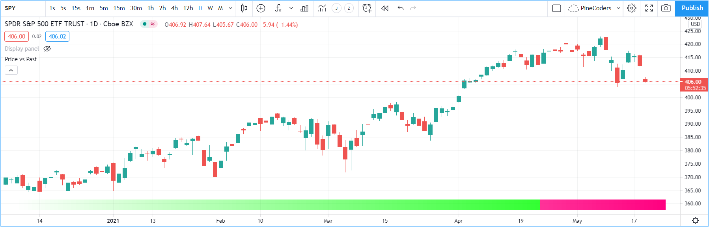

Tables
======

.. contents:: :local:
    :depth: 3

Introduction
------------

Tables are objects that can be used to position information in specific and fixed locations in a script's visual space. 
Contrary to all other plots or objects drawn in Pine, 
tables are not anchored to specific bars; they *float* in a script's space, whether in overlay or pane mode, in studies or strategies,
independently of the chart bars being viewed or the zoom factor used. 

Tables contain cells arranged in columns and rows, much like a spreadsheet. They are created and populated in two distincts steps:

#. A table's structure and key attributes are defined using `table.new() <https://www.tradingview.com/pine-script-reference/v4/#fun_table{dot}new>`__, which returns a table id that acts like a pointer to the table, just like label, line, or array ids do. The `table.new() <https://www.tradingview.com/pine-script-reference/v4/#fun_table{dot}new>`__ call will create the table object but does not display it.
#. Once created, and for it to display, the table must be populated using one `table.cell() <https://www.tradingview.com/pine-script-reference/v4/#fun_table{dot}cell>`__ call for each cell. Table cells can contain text, or not. This second step is when the width and height of cells are defined.

Most attributes of a previously created table can be changed using ``table.set_*()`` setter functions.
Attributes of previously populated cells can be modified using ``table.cell_set_*()`` functions.

A table is positioned in an indicator's space by anchoring it to one of nine references: the four corners or midpoints, including the center. 
Tables are positioned by expanding the table from its anchor, so a table anchored to the ``position.middle_right`` reference will be drawn by expanding up, 
down and left from that anchor.

Two modes are available to determine the width/height of table cells:

- A default automatic mode calculates the width/height of cells in a column/row using the widest/highest text in them. 
- An explicit mode allows programmers to define the width/height of cells using a percentage of the indicator's available x/y space.

Displayed table contents always represent the last state of the table, as it was drawn on the script's last execution, on the dataset's last bar.
Contrary to values displayed in the Data Window or in indicator values, 
variable contents displayed in tables will thus not change as a script user moves his cursor over specific chart bars.
For this reason, it is strongly recommended to always restrict execution of all ``table.*()`` calls to either the first or last bars of the dataset. Accordingly:

- Use the `var <https://www.tradingview.com/pine-script-reference/v4/#op_var>`__ keyword to declare tables.
- Enclose all other calls inside an `if <https://www.tradingview.com/pine-script-reference/v4/#op_if>`__ `barstate.islast <https://www.tradingview.com/pine-script-reference/v4/#var_barstate{dot}islast>`__ block.

Multiple tables can be used in one script, as long as they are each anchored to a different position. Each table object is identified by its own id.
Limits on the quantity of cells in all tables are determined by the total number of cells used in one script.

Creating tables
---------------

When creating a table using `table.new() <https://www.tradingview.com/pine-script-reference/v4/#fun_table{dot}new>`__, three parameters are mandatory: the table's position and its number of columns and rows. Five other parameters are optional: the table's background color, the color and width of the table's outer frame, and the color and width of the borders around all cells, excluding the outer frame. All table attributes except its number of columns and rows can be modified using setter functions: 
`table.set_position() <https://www.tradingview.com/pine-script-reference/v4/#fun_table{dot}set_position>`__, 
`table.set_bgcolor() <https://www.tradingview.com/pine-script-reference/v4/#fun_table{dot}set_bgcolor>`__, 
`table.set_frame_color() <https://www.tradingview.com/pine-script-reference/v4/#fun_table{dot}set_frame_color>`__, 
`table.set_frame_width() <https://www.tradingview.com/pine-script-reference/v4/#fun_table{dot}set_frame_width>`__, 
`table.set_border_color() <https://www.tradingview.com/pine-script-reference/v4/#fun_table{dot}set_border_color>`__ and 
`table.set_border_width() <https://www.tradingview.com/pine-script-reference/v4/#fun_table{dot}set_border_width>`__.

Tables can be deleted using `table.delete() <https://www.tradingview.com/pine-script-reference/v4/#fun_table{dot}delete>`__, 
and their content can be selectively removed using `table.clear() <https://www.tradingview.com/pine-script-reference/v4/#fun_table{dot}clear>`__.

When populating cells using `table.cell() <https://www.tradingview.com/pine-script-reference/v4/#fun_table{dot}cell>`__, you must supply an argument for four mandatory parameters: the table id the cell belongs to, its column and row index using indices that start at zero, and the text string the cell contains, which can be null. Seven other parameters are optional: the width and height of the cell, the text's attributes (color, horizontal and vertical alignment, size), and the cell's background color.
All cell attributes can be modified using setter functions: 
`table.cell_set_text() <https://www.tradingview.com/pine-script-reference/v4/#fun_table{dot}cell_set_text>`__, 
`table.cell_set_width() <https://www.tradingview.com/pine-script-reference/v4/#fun_table{dot}cell_set_width>`__, 
`table.cell_set_height() <https://www.tradingview.com/pine-script-reference/v4/#fun_table{dot}cell_set_height>`__, 
`table.cell_set_text_color() <https://www.tradingview.com/pine-script-reference/v4/#fun_table{dot}cell_set_text_color>`__, 
`table.cell_set_text_halign() <https://www.tradingview.com/pine-script-reference/v4/#fun_table{dot}cell_set_text_halign>`__, 
`table.cell_set_text_valign() <https://www.tradingview.com/pine-script-reference/v4/#fun_table{dot}cell_set_text_valign>`__, 
`table.cell_set_text_size() <https://www.tradingview.com/pine-script-reference/v4/#fun_table{dot}cell_set_text_size>`__ and 
`table.cell_set_bgcolor() <https://www.tradingview.com/pine-script-reference/v4/#fun_table{dot}cell_set_bgcolor>`__.

Keep in mind that each successive call to `table.cell() <https://www.tradingview.com/pine-script-reference/v4/#fun_table{dot}cell>`__ redefines **all** the cell's properties, deleting any properties set by previous `table.cell() <https://www.tradingview.com/pine-script-reference/v4/#fun_table{dot}cell>`__ calls on the same cell.

Placing a single value in a fixed position
^^^^^^^^^^^^^^^^^^^^^^^^^^^^^^^^^^^^^^^^^^

Let's create our first table, which will place the value of ATR in the upper-right corner of the chart. We first create a one-cell table, 
then populate that cell::

    //@version=4
    study("ATR", "", true)
    // We use `var` to only initialize the table on the first bar.
    var table atrDisplay = table.new(position.top_right, 1, 1)
    // We call `atr()` outside the `if` block so it executes on each bar.
    myAtr = atr(14)
    if barstate.islast
        // We only populate the table on the last bar.
        table.cell(atrDisplay, 0, 0, tostring(myAtr))

.. image:: images/Tables-ATR-1.png

Note that:

- We use the `var <https://www.tradingview.com/pine-script-reference/v4/#op_var>`__ keyword when creating the table with 
  `table.new() <https://www.tradingview.com/pine-script-reference/v4/#fun_table{dot}new>`__.
- We populate the cell inside an `if <https://www.tradingview.com/pine-script-reference/v4/#op_if>`__ `barstate.islast <https://www.tradingview.com/pine-script-reference/v4/#var_barstate{dot}islast>`__ block using `table.cell() <https://www.tradingview.com/pine-script-reference/v4/#fun_table{dot}cell>`__.
- When populating the cell, we do not specify use the ``width`` or ``height``. The width and height of our cell will thus adjust automatically to the text it contains.
- We call ``atr(14)`` prior to entry in our `if <https://www.tradingview.com/pine-script-reference/v4/#op_if>`__ block so that it evaluates on each bar. 
  Had we used ``tostring(atr(14))`` inside the `if <https://www.tradingview.com/pine-script-reference/v4/#op_if>`__ block, 
  the function would not have evaluated correctly because it would be called on the dataset's last bar without having calculated the necessary values from the previous bars.

Let's improve the usability and aesthethics of our script::

    //@version=4
    study("ATR", "", true)
    i_atrP = input(14,  "ATR period", minval = 1, tooltip = "Using a period of 1 yields True Range.")

    // ————— Produces a string format usable with `tostring()` to restrict precision to ticks.
    f_tickFormat() =>
        _s = tostring(syminfo.mintick)
        _s := str.replace_all(_s, "25", "00")
        _s := str.replace_all(_s, "5",  "0")
        _s := str.replace_all(_s, "1",  "0")

    var table atrDisplay = table.new(position.top_right, 1, 1, bgcolor = color.gray, frame_width = 2, frame_color = color.black)
    myAtr = atr(i_atrP)
    if barstate.islast
        table.cell(atrDisplay, 0, 0, tostring(myAtr, f_tickFormat()), text_color = color.white)

.. image:: images/Tables-ATR-2.png

Note that:

- We used `table.new() <https://www.tradingview.com/pine-script-reference/v4/#fun_table{dot}new>`__ to define a background color, a frame color and its width.
- When populating the cell with `table.cell() <https://www.tradingview.com/pine-script-reference/v4/#fun_table{dot}cell>`__, 
  we set the text to display in white.
- We used the ``f_tickFormat()`` function to restrict the precision of ATR to the chart's tick precision.
- We now use an input to allow the script user to specify the period of ATR. The input also includes a tooltip, 
  which the user can see when he hovers over the "i" icon in the script's "Settings/Inputs" tab.

Coloring the chart's background
^^^^^^^^^^^^^^^^^^^^^^^^^^^^^^^

This example uses a one-cell table to color the chart's background on the bull/bear state of RSI::

    //@version=4
    study("Chart background", "", true)
    i_c_bull = input(color.new(color.green, 95), "Bull", inline = "1")
    i_c_bear = input(color.new(color.red, 95), "Bear", inline = "1")
    // ————— Function colors chart bg on RSI bull/bear state.
    f_colorChartBg(_c_bull, _c_bear) =>
        var table _chartBg = table.new(position.middle_center, 1, 1)
        float _r = rsi(close, 20)
        color _c_bg = _r > 50 ? _c_bull : _r < 50 ? _c_bear : na
        if barstate.islast
            table.cell(_chartBg, 0, 0, width = 100, height = 100, bgcolor = _c_bg)

    f_colorChartBg(i_c_bull, i_c_bear)

Note that:

- We provide users with inputs allowing them to specify the bull/bear colors to use for the background, and send those input colors as arguments to our ``f_colorChartBg()`` function.
- We create a new table only once, using the `var <https://www.tradingview.com/pine-script-reference/v4/#op_var>`__ keyword to declare the table.
- We use `table.cell() <https://www.tradingview.com/pine-script-reference/v4/#fun_table{dot}cell>`__ on the last bar only, to specify the cell's properties. We make the cell the width and height of the indicator's space, so it covers the whole chart.

Creating a display panel
^^^^^^^^^^^^^^^^^^^^^^^^

Tables are ideal to create sophisticated display panels. Not only do they make it possible for display panels to always be visible in a constant position, they provide more flexible formatting because each cell's properties are controlled separately: background, text color, size and alignment, etc.

Here, we create a basic display panel showing a user-selected quantity of MAs values. We display their period in the first column, then their value with a green/red/gray background that varies with price's position with regards to each MA. When price is above/below the MA, the cell's background is colored with the bull/bear color. When the MA falls between the current bar's `open <https://www.tradingview.com/pine-script-reference/v4/#var_open>`__ and `close <https://www.tradingview.com/pine-script-reference/v4/#var_close>`__, the cell's background is of the neutral color.

.. image:: images/Tables-DisplayPanel-1.png

::

    //@version=4
    study("Price vs MA", "", true)

    var string GP1 = "Moving averages"
    int     i_masQty    = input(20, "Quantity", minval = 1, maxval = 40, group = GP1, tooltip = "1-40")
    int     i_masStart  = input(20, "Periods begin at", minval = 2, maxval = 200, group = GP1, tooltip = "2-200")
    int     i_masStep   = input(20, "Periods increase by", minval = 1, maxval = 100, group = GP1, tooltip = "1-100")

    var string GP2 = "Display"
    string  i_tableYpos = input("top", "Panel position", inline = "11", options = ["top", "middle", "bottom"], group = GP2)
    string  i_tableXpos = input("right", "", inline = "11", options = ["left", "center", "right"], group = GP2)
    color   i_c_bull    = input(color.new(color.green, 80), "Bull", inline = "12", group = GP2)
    color   i_c_bear    = input(color.new(color.red, 80), "Bear", inline = "12", group = GP2)
    color   i_c_neutral = input(color.new(color.gray, 80), "Neutral", inline = "12", group = GP2)

    // ————— Produces a string format usable with `tostring()` to restrict precision to ticks.
    f_tickFormat() =>
        string _s = tostring(syminfo.mintick)
        _s := str.replace_all(_s, "25", "00")
        _s := str.replace_all(_s, "5",  "0")
        _s := str.replace_all(_s, "1",  "0")

    var table panel = table.new(i_tableYpos + "_" + i_tableXpos, 2, i_masQty + 1)
    if barstate.islast
        // Table header.
        table.cell(panel, 0, 0, "MA", bgcolor = i_c_neutral)
        table.cell(panel, 1, 0, "Value", bgcolor = i_c_neutral)

    int period = i_masStart
    for _i = 1 to i_masQty
        // ————— Call MAs on each bar.
        float _ma = sma(close, period)
        // ————— Only execute table code on last bar.
        if barstate.islast
            // Period in left column.
            table.cell(panel, 0, _i, tostring(period), bgcolor = i_c_neutral)
            // If MA is between the open and close, use neutral color. If close is lower/higher than MA, use bull/bear color.
            _c_bg = close > _ma ? open < _ma ? i_c_neutral : i_c_bull : open > _ma ? i_c_neutral : i_c_bear
            // MA value in right column.
            table.cell(panel, 1, _i, tostring(_ma, f_tickFormat()), bgcolor = _c_bg)
        period += i_masStep

Note that:

- Users can select the table's position from the inputs, as well as the bull/bear/neutral colors to be used for the background of the right column's cells.
- The table's quantity of rows is determined using the number of MAs the user chooses to display. We add one row for the column headers.
- Even though we populate the table cells on the last bar only, we need to execute the calls to `sma() <https://www.tradingview.com/pine-script-reference/v4/#fun_sma>`__ on every bar so they produce the correct results. The compiler warning that appears when you compile the code can be safely ignored.
- We separate our inputs in two sections using ``group``, and join the relevant ones on the same line using ``inline``. We supply tooltips to document the limits of certain fields using ``tooltip``.

Displaying a heatmap
^^^^^^^^^^^^^^^^^^^^

Our next project is a heatmap, which will indicate the bull/bear relationship of the current price relative to its past values. To do so, we will use a table positioned at the bottom of the chart. We will display colors only, so our table will contain no text; we will simply color the background of its cells to produce our heatmap. The heatmap uses a user-selectable lookback period. It loops across that period to determine if price is above/below each bar in that past, and displays a progressively lighter intensity of the bull/bear color as we go further in the past:

::

    //@version=4
    study("Price vs Past", "", true)

    var int MAX_LOOKBACK = 300

    int     i_lookBack  = input(150, minval = 1, maxval = MAX_LOOKBACK, step = 10)
    color   i_c_Bull    = input(#00FF00ff, "Bull", inline = "11")
    color   i_c_Bear    = input(#FF0080ff, "Bear", inline = "11")

    // ————— Function returning `_color` with `_transp` transparency.
    f_colorNew(_color, _transp) =>
        // color _color : base color to derive a new transparency from. Its current transparency is ignored.
        // float _transp: 0-100 transparency of `_color` to return.
        _r = color.r(_color)
        _g = color.g(_color)
        _b = color.b(_color)
        color _return = color.rgb(_r, _g, _b, _transp)

    // ————— Function draws a heatmap showing the position of the current `_src` relative to its past `_lookBack` values.
    f_drawHeatmap(_src, _lookBack) =>
        // float _src     : evaluated price series.
        // int   _lookBack: number of past bars evaluated.
        // Dependency: MAX_LOOKBACK
        
        // Force historical buffer to a sufficient size.
        max_bars_back(_src, MAX_LOOKBACK)
        // Only run table code on last bar.
        if barstate.islast
            var _heatmap = table.new(position.bottom_center, _lookBack, 1)
            for _i = 1 to i_lookBack
                float _transp = 100. * _i / _lookBack
                if _src > _src[_i]
                    table.cell(_heatmap, _lookBack - _i, 0, bgcolor = f_colorNew(i_c_Bull, _transp))
                else
                    table.cell(_heatmap, _lookBack - _i, 0, bgcolor = f_colorNew(i_c_Bear, _transp))

    f_drawHeatmap(high, i_lookBack)

Note that:

- We define a maximum lookback period as a ``MAX_LOOKBACK`` constant. This is an important value and we use it for two purposes: to specify the number of columns we will create in our one-row table, and to specify the lookback period required for the ``_src`` argument in our function, so that we force Pine to create a historical buffer size that will allow us to refer to the required quantity of past values of ``_src`` in our `for <https://www.tradingview.com/pine-script-reference/v4/#op_for>`__ loop.
- We offer users the possibility of configuring the bull/bear colors in the inputs and we use ``inline`` to place the color selections on the same line.
- Inside our function, we enclose our table-creation code in an `if <https://www.tradingview.com/pine-script-reference/v4/#op_if>`__ `barstate.islast <https://www.tradingview.com/pine-script-reference/v4/#var_barstate{dot}islast>`__ construct so that it only runs on the last bar of the chart.
- The initialization of the table is done inside the `if <https://www.tradingview.com/pine-script-reference/v4/#op_if>`__ statement. Because of that, and the fact that it uses the `var <https://www.tradingview.com/pine-script-reference/v4/#op_var>`__ keyword, initialization only occurs the first time the script executes on a last bar. Note that this behavior is different from the usual `var <https://www.tradingview.com/pine-script-reference/v4/#op_var>`__ declarations in the script's global scope, where initialization occurs on the first bar of the dataset, at `bar_index <https://www.tradingview.com/pine-script-reference/v4/#var_bar_index>`__ zero.
- We do not specify an argument to the ``text`` parameter in our `table.cell() <https://www.tradingview.com/pine-script-reference/v4/#fun_table{dot}cell>`__ calls, so an empty string is used.
- We calculate our transparency in such a way that the intensity of the colors decrease as we go further in history.
- We use dynamic color generation to create different transparencies of our base colors as needed.
- Contrary to other objects displayed in Pine scripts, this heatmap's cells are not linked to chart bars. The configured lookback period determines how many table cells the heatmap contains, and the heatmap will not change as the chart is panned horizontally, or scaled.
- The maximum number of cells that can be displayed in the scritp's visual space will depend on your viewing device's resolution and the portion of the display used by your chart. Higher resolution screens and wider windows will allow more table cells to be displayed.

Tips
----

- When creating tables in strategy scripts, keep in mind that unless the strategy uses ``calc_on_every_tick = true``, table code enclosed in `if <https://www.tradingview.com/pine-script-reference/v4/#op_if>`__ `barstate.islast <https://www.tradingview.com/pine-script-reference/v4/#var_barstate{dot}islast>`__ blocks will not execute on each realtime update, so the table will not display as you expect.
- Keep in mind that successive calls to `table.cell() <https://www.tradingview.com/pine-script-reference/v4/#fun_table{dot}cell>`__ overwrite the cell's properties specified by previous `table.cell() <https://www.tradingview.com/pine-script-reference/v4/#fun_table{dot}cell>`__ calls. Use the setter functions to modify a cell's properties.
- Remember to control the execution of your table code wisely by restricting it to the necessary bars only. This saves server resources and your charts will display faster, so everybody wins.
