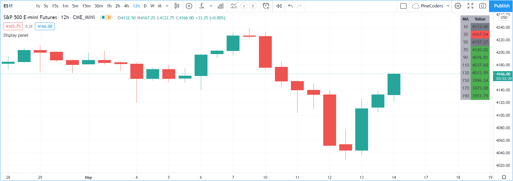

Tables
======

.. contents:: :local:
    :depth: 3

Introduction
------------

Tables are objects that can be used to position information in specific and fixed locations in a script's visual space. 
Contrary to all other plots or objects drawn in Pine, 
tables are not anchored to specific bars; they *float* in a script's space, whether in overlay or pane mode, in studies or strategies,
independently of the chart bars being viewed or the zoom factor used. 

Tables contain cells arranged in columns and rows, much like a spreadsheet. 
A table's structure and key attributes are defined using `table.new() <https://www.tradingview.com/pine-script-reference/v4/#fun_table{dot}new>`__, 
which returns a table id that acts like a pointer to the table, just like label, line, or array ids do.
The `table.new() <https://www.tradingview.com/pine-script-reference/v4/#fun_table{dot}new>`__ call will create the table but does not display it.
Once created, the table must be populated using one 
`table.cell() <https://www.tradingview.com/pine-script-reference/v4/#fun_table{dot}cell>`__ call for each cell. 
Table cells can contain text, or not.

Some attributes of a previously created table can be changed using ``table.set_*()`` setter functions.
Attributes of previously populated cells can be modified using ``table.cell_set_*()`` functions.

A table is positioned in an indicator's space by anchoring it to one of nine references: the four corners or a midpoint between two of them. 
Tables are positioned by expanding the table from its anchor, so a table anchored to the ``middle_right`` reference will be drawn by expanding up, 
down and left from that anchor.

Two modes are available to determine the width/height of table cells:

- A default automatic mode calculates the width/height of cells in a column/row using the widest/highest text in them. 
- An explicit mode allows programmers to define the width/height of cells using a percentage of the indicator's available x/y space.

Displayed table contents always represent the last state of the table, as it was drawn on the script's last execution, on the dataset's last bar.
Contrary to values displayed in the Data Window or in indicator values, 
variable contents displayed in tables will thus not change as a script user moves his cursor over specific chart bars.
For this reason, it is strongly recommended to always restrict execution of all ``table.*()`` calls to either the first or last bars of the dataset. Accordingly:

- Use the `var <https://www.tradingview.com/pine-script-reference/v4/#op_var>`__ keyword to declare tables.
- Enclose all other calls inside an `if <https://www.tradingview.com/pine-script-reference/v4/#op_if>`__ `barstate.islast <https://www.tradingview.com/pine-script-reference/v4/#var_barstate{dot}islast>`__ block.

Multiple tables can be used in one script, each one identified by its own id.
Limits on the quantity of cells in all tables are determined by the total number of cells used in one script.

Creating tables
---------------

When creating a table using `table.new() <https://www.tradingview.com/pine-script-reference/v4/#fun_table{dot}new>`__, three parameters are mandatory: the table's position and its number of columns and rows. Five other parameters are optional: the table's background color, the color and width of the table's outer frame, and the color and width of the borders around all cells, excluding the outer frame. All table attributes except its number of columns and rows can be modified using setter functions: 
`table.set_position() <https://www.tradingview.com/pine-script-reference/v4/#fun_table{dot}set_position>`__, 
`table.set_bgcolor() <https://www.tradingview.com/pine-script-reference/v4/#fun_table{dot}set_bgcolor>`__, 
`table.set_frame_color() <https://www.tradingview.com/pine-script-reference/v4/#fun_table{dot}set_frame_color>`__, 
`table.set_frame_width() <https://www.tradingview.com/pine-script-reference/v4/#fun_table{dot}set_frame_width>`__, 
`table.set_border_color() <https://www.tradingview.com/pine-script-reference/v4/#fun_table{dot}set_border_color>`__ and 
`table.set_border_width() <https://www.tradingview.com/pine-script-reference/v4/#fun_table{dot}set_border_width>`__.

Tables can be deleted using `table.delete() <https://www.tradingview.com/pine-script-reference/v4/#fun_table{dot}delete>`__, 
and their content can be removed using `table.clear() <https://www.tradingview.com/pine-script-reference/v4/#fun_table{dot}clear>`__.

When populating cells using `table.cell() <https://www.tradingview.com/pine-script-reference/v4/#fun_table{dot}cell>`__, you must supply an argument for four mandatory parameters: the table id the cell belongs to, its column and row index using indices that start at zero, and the text string the cell contains, which can be null. Seven other parameters are optional: the width and height of the cell, the text's attributes (color, horizontal and vertical alignment, size), and the cell's background color.
All cell attributes can be modified using setter functions: 
`table.cell_set_text() <https://www.tradingview.com/pine-script-reference/v4/#fun_table{dot}cell_set_text>`__, 
`table.cell_set_width() <https://www.tradingview.com/pine-script-reference/v4/#fun_table{dot}cell_set_width>`__, 
`table.cell_set_height() <https://www.tradingview.com/pine-script-reference/v4/#fun_table{dot}cell_set_height>`__, 
`table.cell_set_text_color() <https://www.tradingview.com/pine-script-reference/v4/#fun_table{dot}cell_set_text_color>`__, 
`table.cell_set_text_halign() <https://www.tradingview.com/pine-script-reference/v4/#fun_table{dot}cell_set_text_halign>`__, 
`table.cell_set_text_valign() <https://www.tradingview.com/pine-script-reference/v4/#fun_table{dot}cell_set_text_valign>`__, 
`table.cell_set_text_size() <https://www.tradingview.com/pine-script-reference/v4/#fun_table{dot}cell_set_text_size>`__ and 
`table.cell_set_bgcolor() <https://www.tradingview.com/pine-script-reference/v4/#fun_table{dot}cell_set_bgcolor>`__.

Placing a single value in a fixed position
^^^^^^^^^^^^^^^^^^^^^^^^^^^^^^^^^^^^^^^^^^

Let's create our first table, which will place the value of ATR in the upper-right corner of the chart. We first create a one-cell table, 
then populate that cell::

    //@version=4
    study("ATR", "", true)
    // We use `var` to only initialize the table on the first bar.
    var table atrDisplay = table.new(position.top_right, 1, 1)
    // We call `atr()` outside the `if` block so it executes on each bar.
    myAtr = atr(14)
    if barstate.islast
        // We only populate the table on the last bar.
        table.cell(atrDisplay, 0, 0, tostring(myAtr))

.. image:: images/Tables-ATR-1.png

Note that:

- We use the `var <https://www.tradingview.com/pine-script-reference/v4/#op_var>`__ keyword when creating the table with 
  `table.new() <https://www.tradingview.com/pine-script-reference/v4/#fun_table{dot}new>`__.
- We populate the cell inside an `if <https://www.tradingview.com/pine-script-reference/v4/#op_if>`__ `barstate.islast <https://www.tradingview.com/pine-script-reference/v4/#var_barstate{dot}islast>`__ block using `table.cell() <https://www.tradingview.com/pine-script-reference/v4/#fun_table{dot}cell>`__.
- When populating the cell, we do not specify use the ``width`` or ``height``. The width and height of our cell will thus adjust automatically to the text it contains.
- We call ``atr(14)`` prior to entry in our `if <https://www.tradingview.com/pine-script-reference/v4/#op_if>`__ block so that it evaluates on each bar. 
  Had we used ``tostring(atr(14))`` inside the `if <https://www.tradingview.com/pine-script-reference/v4/#op_if>`__ block, 
  the function would not have evaluated correctly because it would be called on the dataset's last bar without having calculated the necessary values from the previous bars.

Let's improve the usability and aesthethics of our script::

    //@version=4
    study("ATR", "", true)
    i_atrP = input(14,  "ATR period", minval = 1, tooltip = "Using a period of 1 yields True Range.")

    // ————— Produces a string format usable with `tostring()` to restrict precision to ticks.
    f_tickFormat() =>
        _s = tostring(syminfo.mintick)
        _s := str.replace_all(_s, "25", "00")
        _s := str.replace_all(_s, "5",  "0")
        _s := str.replace_all(_s, "1",  "0")

    var table atrDisplay = table.new(position.top_right, 1, 1, bgcolor = color.gray, frame_width = 2, frame_color = color.black)
    myAtr = atr(i_atrP)
    if barstate.islast
        table.cell(atrDisplay, 0, 0, tostring(myAtr, f_tickFormat()), text_color = color.white)

.. image:: images/Tables-ATR-2.png

Note that:

- We used `table.new() <https://www.tradingview.com/pine-script-reference/v4/#fun_table{dot}new>`__ to define a background color, a frame color and its width.
- When populating the cell with `table.cell() <https://www.tradingview.com/pine-script-reference/v4/#fun_table{dot}cell>`__, 
  we set the text to display in white.
- We used the ``f_tickFormat()`` function to restrict the precision of ATR to the chart's tick precision.
- We now use an input to allow the script user to specify the period of ATR. The input also includes a tooltip, 
  which the user can see when he hovers over the "i" icon in the script's "Settings/Inputs" tab.

Coloring the chart's background
^^^^^^^^^^^^^^^^^^^^^^^^^^^^^^^

This example uses a one-cell table to color the chart's background on the bull/bear state of RSI::

    //@version=4
    study("Chart background", "", true)
    i_c_bull = input(color.new(color.green, 95), "Bull", inline = "1")
    i_c_bear = input(color.new(color.red, 95), "Bear", inline = "1")
    // ————— Function colors chart bg on RSI bull/bear state.
    f_colorChartBg(_c_bull, _c_bear) =>
        var table _chartBg = table.new(position.middle_center, 1, 1)
        float _r = rsi(close, 20)
        color _c_bg = _r > 50 ? _c_bull : _r < 50 ? _c_bear : na
        if barstate.islast
            table.cell(_chartBg, 0, 0, width = 100, height = 100, bgcolor = _c_bg)

    f_colorChartBg(i_c_bull, i_c_bear)

Note that:

- We provide users with inputs allowing them to specify the bull/bear colors to use for the background, and send those input colors as arguments to our ``f_colorChartBg()`` function.
- We create a new table only once, using the `var <https://www.tradingview.com/pine-script-reference/v4/#op_var>`__ keyword to declare the table.
- We use `table.cell() <https://www.tradingview.com/pine-script-reference/v4/#fun_table{dot}cell>`__ on the last bar only, to specify the cell's properties. We make the cell the width and height of the indicator's space, so it covers the whole chart.

Creating a display panel
^^^^^^^^^^^^^^^^^^^^^^^^

Tables are ideal to create sophisticated display panels. Not only do they make it possible for display panels to always be visible in a constant position, they allow for more formatting possiblities because each cell's properties are controlled separately: background, text color, size and alignment, etc.

Here, we create a display panel showing a user-selected quantity of MAs. We display their period in the first column, then their value with a green/red/gray background depending on price's position with regards to each MA::

    //@version=4
    study("Display panel", "", true)

    int     i_masQty    = input(10, "Quantity of MAs", minval = 1, maxval = 40)
    int     i_masPeriod = input(10, "Beginning at Period", minval = 1, maxval = 40)
    int     i_masStep   = input(20,  "Increasing by", minval = 1, maxval = 25)

    var string GP1 = "Display panel"
    string  i_tableYpos = input("top", "Table position", inline = "21", options = ["top", "middle", "bottom"], group = GP1)
    string  i_tableXpos = input("right", "", inline = "21", options = ["left", "center", "right"], group = GP1)
    color   i_c_bull    = input(color.green, "Bull", inline = "1", group = GP1)
    color   i_c_bear    = input(color.red, "Bear", inline = "1", group = GP1)
    color   i_c_neutral = input(color.gray, "Neutral", inline = "1", group = GP1)

    // ————— Function returns the table position from user selection.
    f_tablePos(_tableXpos, _tableYpos) =>
        _tableYpos   == "top"    and _tableXpos == "left"   ? position.top_left       :
          _tableYpos == "top"    and _tableXpos == "center" ? position.top_center     :
          _tableYpos == "top"    and _tableXpos == "right"  ? position.top_right      :
          _tableYpos == "middle" and _tableXpos == "left"   ? position.middle_left    :
          _tableYpos == "middle" and _tableXpos == "center" ? position.middle_center  :
          _tableYpos == "middle" and _tableXpos == "right"  ? position.middle_right   :
          _tableYpos == "bottom" and _tableXpos == "left"   ? position.bottom_left    :
          _tableYpos == "bottom" and _tableXpos == "center" ? position.bottom_center  :
          _tableYpos == "bottom" and _tableXpos == "right"  ? position.bottom_right   : na

    // ————— Produces a string format usable with `tostring()` to restrict precision to ticks.
    f_tickFormat() =>
        _s = tostring(syminfo.mintick)
        _s := str.replace_all(_s, "25", "00")
        _s := str.replace_all(_s, "5",  "0")
        _s := str.replace_all(_s, "1",  "0")

    var table panel = table.new(f_tablePos(i_tableXpos, i_tableYpos), 2, i_masQty + 1, bgcolor = color.silver)

    int _line = 1
    int _period = i_masPeriod
    for _i = 1 to i_masQty
        _ma = sma(close, _period)
        if barstate.islast
            // Table header.
            table.cell(panel, 0, 0, "MA")
            table.cell(panel, 1, 0, "Value")
            // Period in left column.
            table.cell(panel, 0, _line, tostring(_period))
            // If MA is between the open and close, use neutral color. If close is lower/higher than MA, use bull/bear color.
            _c_bg = close > _ma ? open < _ma ? i_c_neutral : i_c_bull : open > _ma ? i_c_neutral : i_c_bear
            // MA value in right column.
            table.cell(panel, 1, _line, tostring(_ma, f_tickFormat()), bgcolor = _c_bg)
        _line += 1
        _period += i_masStep

Note that:

- Users can select the table's position from the inputs, as well as the bull/bear/neutral colors to be used for the background of the right column's cells.
- The lines creating the table are actually quite few, in the last part of the script. Most of the other lines are to manage inputs and formats.

Creating a debugging console
^^^^^^^^^^^^^^^^^^^^^^^^^^^^

Displaying a heatmap
^^^^^^^^^^^^^^^^^^^^

Tips
----

