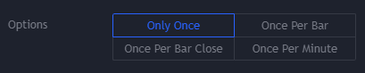

.. image:: /images/Pine_Script_logo.svg
   :alt: Pine Script™ logo
   :target: https://www.tradingview.com/pine-script-docs/en/v5/Introduction.html
   :align: right
   :width: 100
   :height: 100

.. _PageAlertsFaq:

Alerts FAQ
==========

.. contents:: :local:
    :depth: 3

How do I make an alert available using my script?
-------------------------------------------------

There are four ways in which alerts can be added to scripts:

    1. Insert an `alert() <https://www.tradingview.com/pine-script-reference/v5/#fun_alert>`__ call in a script.
        ::

        triggerCondition = close > close[1]
        if triggerCondition
            alert("Current close (" + str.tostring(close) + ") is higher than previous close (" + str.tostring(close[1]) + ")", alert.freq_once_per_bar)

    2. Insert an `alertcondition() <https://www.tradingview.com/pine-script-reference/v5/#fun_alertcondition>`__ call in a script.

        ::

        triggerCondition = close > close[1]
        alertcondition(triggerCondition, title = "Create Alert dialog box name", message = "Text sent with alert.")

    3. Create an alert from the TV Web user interface (ALT-A) and choose the script’s alert condition.
    4. Strategy based alerts generated from `strategy order fills <https://www.tradingview.com/pine-script-reference/v5/?solution=43000481368>`__.

When more than one condition can trigger a single alert, you will most probably need to have visual cues for each condition so that when users bring up a chart on 
which an alert triggered, they can figure out which condition caused the alert to trigger. This is a method that allows users of your script to customize the alert to fit their needs.

When TradingView creates an alert, it saves a snapshot of the environment that will enable the alert to run on our servers. The elements saved with an alert are:

    * Current symbol
    * Current time frame
    * State of the script’s Inputs selections
    * Current version of the script. Subsequent updates to the script’s code will not affect the alerts created with prior versions

Note that while alert condition code will compile in strategy scripts, alerts are only functional in studies.

How can I include values that change in my alerts?
--------------------------------------------------

Numeric values plotted by an indicator can be inserted in an alert text using placeholders. If you use:

::

    plot(myRsi, "rsiLine")

in your script, then you can include that plot’s value in an alert message by using:

::

    alertcondition(close > open, message = 'RSI value is: {{plot("rsiLine")}}')

If you are not already plotting a value which you must include in an alert message, you can plot it using this method so that 
plotting the value will not affect the price scale unless you use:

::
    
    plotchar(myRsi, "myRsi", "", location.top)

You can use other pre-defined placeholders to include variable information in alert messages. 
See this `TV blog post on variable alerts <https://www.tradingview.com/blog/en/introducing-variables-in-alerts-14880>`__ for more information.

    Note that there is still no way to include variable text in an alert message.

I have a custom script that generates alerts. How do I run it on many symbols?
------------------------------------------------------------------------------

You need to create a separate alert for each symbol. There is currently no way to create an alert for all the symbols in a watchlist or for the Screener.

By using a `security() <https://www.tradingview.com/pine-script-reference/v5/#var_request{dot}security>`__ call for each symbol (maximum 40), 
you can monitor more than one symbol with the same script, and generate alerts containing the symbol’s name using placeholders in your alert’s text. 
See this `TV blog post on variable alerts <https://www.tradingview.com/blog/en/introducing-variables-in-alerts-14880>`__ for more information.

If one of the generic indicators supplied with the Screener suits your needs and your symbols are tagged with a color label, 
you can create an alert on those markets from within the Screener.

Is it possible to use a string that varies as an argument to the alert() or alertcondition() function’s message= parameter?
---------------------------------------------------------------------------------------------------------------------------

The `alert() <https://www.tradingview.com/pine-script-reference/v5/#fun_alert>`__ or `alertcondition() <https://www.tradingview.com/pine-script-reference/v5/#fun_alertcondition>`__ 
functions both take a constant string as an argument. 
A constant string means that the value is known before the script compiles and can't be changed based on the underlying code. 
Here is some example code that shows you how you can partially get around this limitation:

::

    //@version=5
    indicator('alertcondition() arguments')

    // ————— These strings will not work.
    // The rsi() value can only be known at runtime time and it is a "series",
    // so "wrongMsgArg1" becomes a "series string".
    wrongMsgArg1 = 'RSI value is:' + str.tostring(ta.rsi(close, 14))
    // This does not work because although the result can be calculated at compile time,
    // "tostring()" returns a "simple string" (a.k.a. "string"),
    // and automatic casting rules do not allow for that type to be cast to "const string".
    wrongMsgArg2 = 'Enter at: ' + str.tostring(100.3)
    // This fails because the condition can only be evaluated at compile time,
    // so the result of the ternary is a "series string".
    wrongMsgArg3 = close > open ? 'Long Entry' : 'Short Entry'

    // ————— These strings will work because:
    // ————— 1. They can be evaluated at compile time,
    // ————— 2. Their type is "literal string" or "const string".
    // Test condition "false" is known at compile time and result of ternary is a "const string".
    goodMsgArg1 = false ? 'Long Entry' : 'Short Entry'
    // Both values in the expression are literal strings known at compile time. Result is "const string".
    goodMsgArg2 = 'AAA ' + 'BBB'

    alertcondition(true, title='Id appearing in Create Alert db', message=goodMsgArg1)

    // ————— Workaround
    cond1 = ta.rising(close, 5)
    cond2 = ta.falling(close, 5)
    alertcondition(cond1, title='cond1', message='cond1 Text')
    alertcondition(cond2, title='cond2', message='cond2 Text')

Please note that:
    * This example shows `alertcondition() <https://www.tradingview.com/pine-script-reference/v5/#fun_alertcondition>`__ only but the concept is 
    functionally the same using the ``alert()`` function.
    * We can also use `placeholders <https://www.tradingview.com/pine-script-reference/v5/?solution=43000531021#fun_alert>`__ to construct alert messages consisting of variables.

How can I trigger an alert only once when the condition is true the first time?
-------------------------------------------------------------------------------

The `alert() <https://www.tradingview.com/pine-script-reference/v5/#fun_alert>`__ function takes an alert frequency as an argument. Possible values are:
    1. `alert.freq_all <https://www.tradingview.com/pine-script-reference/v5/#var_alert{dot}freq_all>`__
    2. `alert.freq_once_per_bar <https://www.tradingview.com/pine-script-reference/v5/#var_alert{dot}freq_once_per_bar>`__
    3. `alert.freq_once_per_bar_close <https://www.tradingview.com/pine-script-reference/v5/#var_alert{dot}freq_once_per_bar_close>`__

For alerts based on other types, users can set the frequency in the alert widget.

.. image:: /images/TradingView-Logo-Block.svg
    :width: 200px
    :align: center
    :target: https://www.tradingview.com/
