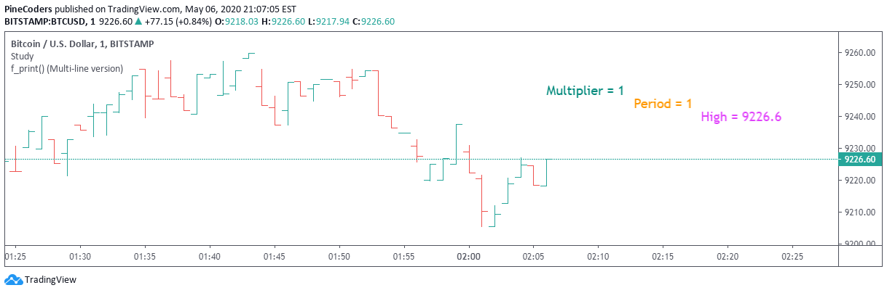

.. _PageProgrammingFaq:

.. image:: /images/Pine_Script_logo.svg
   :alt: Pine Script™ logo
   :target: https://www.tradingview.com/pine-script-docs/en/v5/Introduction.html
   :align: right
   :width: 100
   :height: 100

Programming FAQ
===============

.. contents:: :local:
    :depth: 3

How can I access the built-in indicators' source code?
------------------------------------------------------

From the Pine Script™ Editor, go to the Open menu, click on the New built-in script option, and then select the built-in you want to work with. 
Please note that some built-ins like the Volume Profile indicators are not written in Pine Script™ and so their behavior cannot be reproduced in Pine Script™.

How can I make the console appear in the editor?
------------------------------------------------

Use the CTRL + ` (grave accent) keyboard shortcut or right click on the script’s name and choose Show Console.

How can I convert a script from one version to another?
-------------------------------------------------------

* v1 to v2
    Select all code and then delete it. There is no reason why you should still have v1 code.
* v2 to v3
    Converting from v2 is fairly complicated and can't be easily converted like in later versions. 
    For more information, you should read this `conversion article <https://www.tradingview.com/pine-script-docs/en/v5/migration_guides/To_Pine_version_3.html>`__.
* v3 to v4 or v4 to v5
    Simply click on the three dots to the right of the Publish script button and you will see an option that says Convert to v4 or v5 depending on the current version of the script.

How can I examine the value of a string in my script?
-----------------------------------------------------

See the this section of the Pine Script™ User Manual on `debugging strings <https://www.tradingview.com/pine-script-docs/en/v5/writing/Debugging.html#displaying-strings>`__.

This example shows how you can print custom data on a chart using different colored lines:

::
    //@version=5
    indicator('print() (Multi-line version)', '', true)
    print(_txt, _y, _color, _offsetLabels) =>
        // Calculate time offset into the future.
        var _timeDelta = 10e15
        _timeDelta := math.min(time - nz(time[1]), _timeDelta)
        _t = int(time + _timeDelta * _offsetLabels)
        // We create the label on the first bar and then only update it when on the dataset's last bar; it's more efficient.
        var label _lbl = label.new(_t, _y, _txt, xloc.bar_time, yloc.price, #00000000, label.style_none, _color, size.large)
        if barstate.islast
            label.set_xy(_lbl, _t, _y)
            label.set_text(_lbl, _txt)
            label.set_textcolor(_lbl, _color)

    // We exclude the current candle's value in the calculation so the y position is more stable.
    y = ta.highest(10)[1]
    // The newlines at the end of the strings allow us to overprint different labels to make different lines distinct colors.
    t1 = 'Multiplier = ' + str.tostring(timeframe.multiplier) + '\n\n'
    t2 = 'Period = ' + timeframe.period + '\n'
    t3 = 'High = ' + str.tostring(high)
    print(t1, y, color.teal, 3)
    print(t2, y, color.orange, 9)
    print(t3, y, color.fuchsia, 15)

How can I plot numeric values so that they do not disrupt the indicator’s scale?
--------------------------------------------------------------------------------

See the this section of the Pine Script™ User Manual on `displaying numeric values when the script’s scale must be 
preserved <https://www.tradingview.com/pine-script-docs/en/v5/writing/Debugging.html#when-the-script-s-scale-must-be-preserved>`__.

How can I visualize my script’s conditions on the chart?
--------------------------------------------------------

See the this section of the Pine Script™ User Manual on `debugging compound conditions <https://www.tradingview.com/pine-script-docs/en/v5/writing/Debugging.html#compound-conditions>`__.

What does scope mean?
---------------------

There are only two types of scope: global and local. Some people will prefer using the terminology of local blocks instead of local scopes but it means the same thing. 
In the latest version of Pine Script™, the easiest way to remember the difference between global and local is that a local block is indented using a tab or 4 spaces. 
For a more in-depth overview of scopes, please read `this article <https://www.tradingview.com/pine-script-docs/en/v5/language/Script_structure.html#code>`__.

::
    //@version=5
    indicator("Scope example")

    // global scope
    int cond1 = close > open ? 1 : -1

    // local scope
    if barstate.islast
        int cond2 = close > open ? 1 : -1

    plot(cond1)
    plot(cond2) // Undeclared identifier error for trying to access a local scope when you are using the global scope

Please note that:
    * You are allowed to access variables declared in a global scope from anywhere but can only access variables declared in a local scope inside the local scope.
    * We can declare the `cond2` variable in the global scope and only change the value in a local scope to get this code to compile properly.
    

Can I access the source code of ‘Invite-Only’ or ‘closed source’ scripts?
-------------------------------------------------------------------------

No. Closed source scripts are called that because the source will always be closed to everyone but the creator. 
Invite-Only scripts are also closed source but they differ because they have an additional restriction that only users on the invite list can add the script to their charts.

Why do historical references not work in loops?
-----------------------------------------------

Any variables defined inside loops will only hold the value of the last iteration in the history. 
Hence, using the historical references of these values within the loop will lead to incorrect calculations as the historical values are not as expected.
Below we have an example showing how historical references inside loops don't work as expected and a workaround that will correct the issue:

::

    //@version=5
    indicator("Historical reference inside loop error")

    // incorrect way to handle historical references inside a loop
    int sum1 = 0
    for i = 1 to 10
        temp = i
        sum1 += temp[1]
        
    // correct way to do a workaround for the above example
    int sum2 = 0
    for i = 1 to 10
        sum2 += i - 1

    plot(sum1)
    plot(sum2)

.. note:: In the above code, even if the ``temp`` variable in a loop has values from 1-10, ``temp[1]`` will always be 10 (value of ``temp`` in last iteration). Hence, sum1 will calculate to be 100 instead of the correct 45.

Is Pine Script™ an object-oriented language?
--------------------------------------------

.. image:: /images/TradingView-Logo-Block.svg
    :width: 200px
    :align: center
    :target: https://www.tradingview.com/