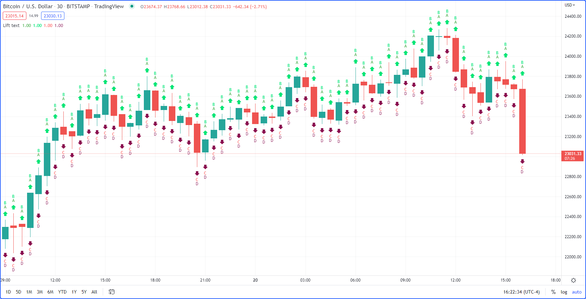
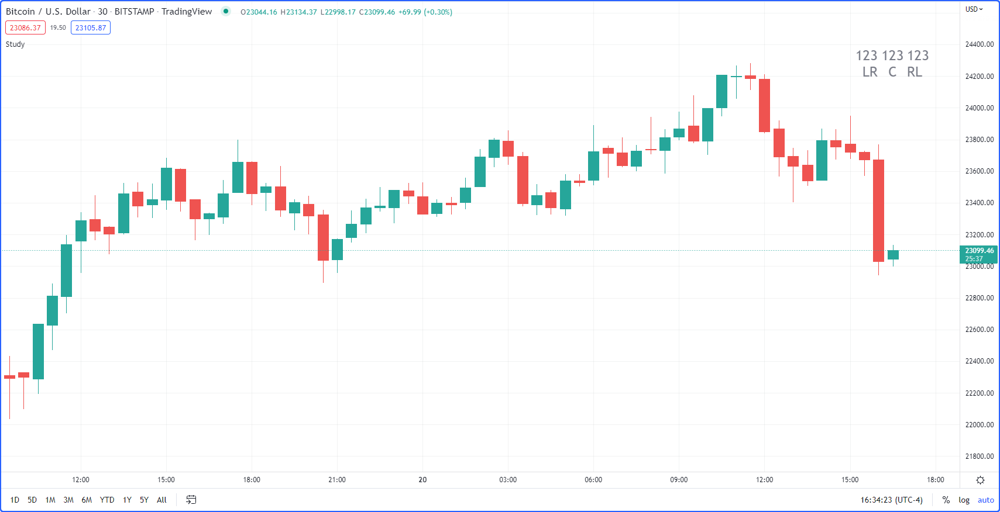

.. image:: /images/Pine_Script_logo.svg
   :alt: Pine Script™ logo
   :target: https://www.tradingview.com/pine-script-docs/en/v5/Introduction.html
   :align: right
   :width: 100
   :height: 100

.. _PageStringsAndFormattingFaq:

Strings and formatting FAQ
==========================

.. contents:: :local:
    :depth: 3

How can I place text on chart?
------------------------------

You can display text using one of the following methods:

 - The `plotchar() <https://www.tradingview.com/pine-script-reference/v5/#fun_plotchar>`__ or 
   `plotshape() <https://www.tradingview.com/pine-script-reference/v5/#fun_plotshape>`__ functions.
        The `plotchar() <https://www.tradingview.com/pine-script-reference/v5/#fun_plotchar>`__ or 
        `plotshape() <https://www.tradingview.com/pine-script-reference/v5/#fun_plotshape>`__ functions are useful to display fixed text on bars. 
        There is no limit to the number of bars you may use those functions on, but you can't decide at runtime which text to print. 
        One `plotchar() <https://www.tradingview.com/pine-script-reference/v5/#fun_plotchar>`__ call can print only one character on a bar. 
        Using `plotshape()'s <https://www.tradingview.com/pine-script-reference/v5/#fun_plotshape>`__ text parameter, you can plot a string. 
        When you want to print two different characters on bars depending on a condition that can only be evaluated at runtime, 
        you must use two distinct calls, each one printing on a different condition:

        ::

            //@version=5
            indicator('', '', true)
            bool barUp = close > open
            bool barDn = close < open
            plotchar(barUp, 'Up', '▲', location.top, size = size.tiny)
            plotchar(barDn, 'Down', '▼', location.bottom, size = size.tiny)

        We need two distinct calls here because the argument to the char parameter in `plotchar() <https://www.tradingview.com/pine-script-reference/v5/#fun_plotchar>`__ 
        must be of “input string” type, which means it can be determined by an input, but not calculated dynamically at runtime. This for example, would not work:

        ::

            plotchar(barUp or barDn, 'Up/Down', barUp ? '▲' : '▼', location.top, size = size.tiny)

 - Labels
        Labels are useful when the text you want to display needs to vary from bar to bar. 
        They are required when you want to print values on the chart such as pivot levels, which cannot be known before the script executes. 
        There is a limit to the number of labels that can be displayed by a script. There is a default of displaying the 50 most recent labels drawn by the script. 
        You can increase that value to a max of 500 using the ``max_labels_count`` parameter of the `indicator() <https://www.tradingview.com/pine-script-reference/v5/#fun_indicator>`__ 
        or `strategy() <https://www.tradingview.com/pine-script-reference/v5/#fun_strategy>`__ functions.

        This shows how you can use labels to display more or less the equivalent of our first example using labels. 
        Notice how we can now determine both the label’s text and position at runtime using “series string” arguments:

        ::

            //@version=5
            indicator('', '', true)
            bool barUp = close > open
            bool barDn = close < open
            label.new(bar_index, na, barUp ? '▲' : '▼', yloc = barUp ? yloc.belowbar : yloc.abovebar, color = na, textcolor = color.blue)
 - Tables
        Tables are useful to display text that floats in a fixed position of the indicator’s visual space, untethered to chart bars.

How can I lift plotshape() text up?
-----------------------------------

You will need to use \n followed by a special non-printing character that doesn’t get stripped out. Here we’re using U+200E. 
While you don’t see it in the following code’s strings, it is there and can be copied/pasted. 
The special Unicode character needs to be the last one in the string for text going up, and the first one when you are plotting under the bar and text is going down:

::

    //@version=5
    indicator('Lift text', '', true)
    // Use U+200E (Decimal 8206) as a non-printing space after the last "\n".
    // The line will become difficult to edit in the editor, but the character will be there.
    // You can use https://unicode-table.com/en/tools/generator/ to generate a character you can copy/paste.
    plotshape(true, '', shape.arrowup, location.abovebar, color.new(color.green, 0), text='A')
    plotshape(true, '', shape.arrowup, location.abovebar, color.new(color.lime, 0), text='B\n‎')
    plotshape(true, '', shape.arrowdown, location.belowbar, color.new(color.red, 0), text='C')
    plotshape(true, '', shape.arrowdown, location.belowbar, color.new(color.maroon, 0), text='‎\nD')

How can I position text on either side of a single bar?
-------------------------------------------------------

By choosing label styles like `style = label.style_label_left`, we can determine on which side of the bar the label is positioned. 
Note that since the 'left'/'right' in there specifies the pointer’s position, 'left' has the side effect of positioning the label on the right side of the bar. 
The text’s alignment in the label can be controlled using `textalign = text.align_right`, and finally, 
we can make the label’s background color transparent so we only display the text:

::

    //@version=5
    indicator('', '', true)
    print(_txt, _pos, _align) =>
        var _lbl = label.new(bar_index, ta.highest(10)[1], _txt, xloc.bar_index, yloc.price, #00000000, _pos, color.gray, size.huge, _align)
        label.set_xy(_lbl, bar_index, ta.highest(10)[1])
        label.set_text(_lbl, _txt)
    print('123\nRL', label.style_label_left, text.align_left)
    print('123\nLR', label.style_label_right, text.align_right)
    print('123\nC', label.style_label_center, text.align_center)

How can I print a value at the top right of the chart?
------------------------------------------------------

See `this example <https://www.tradingview.com/pine-script-docs/en/v5/concepts/Tables.html#placing-a-single-value-in-a-fixed-position>`__ in the Pine Script™ 
User Manual which uses a table to do it.

How can I split a string into characters?
-----------------------------------------

It can be done using `str.split() <https://www.tradingview.com/pine-script-reference/v5/#fun_str{dot}split>`__ and an empty string argument for the separator parameter. 
This splits the string into an array of characters:

::

    //@version=5
    indicator('Split a string into characters')
    print(_text) =>
        var _label = label.new(bar_index, na, _text, xloc.bar_index, yloc.price, color(na), label.style_none, color.gray, size.large, text.align_left)
        label.set_xy(_label, bar_index, ta.highest(10)[1])
        label.set_text(_label, _text)

    i_sourceString = input('123456789')
    arrayOfCharacters = str.split(i_sourceString, '')

    print('i_sourceString: [' + i_sourceString + ']\n')
    print('arrayOfCharacters: ' + str.tostring(arrayOfCharacters))

.. image:: /images/TradingView-Logo-Block.svg
    :width: 200px
    :align: center
    :target: https://www.tradingview.com/