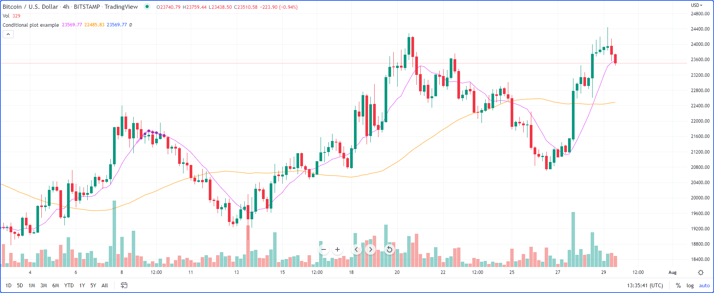

.. image:: /images/Pine_Script_logo.svg
   :alt: Pine Script™ logo
   :target: https://www.tradingview.com/pine-script-docs/en/v5/Introduction.html
   :align: right
   :width: 100
   :height: 100

.. _PageVisualsFaq:

Visuals FAQ
===========

.. contents:: :local:
    :depth: 3

Why can’t I use a plot in an if or for statement?
-------------------------------------------------

It’s not allowed in Pine Script™ but you can use many different conditions to control plotting and the color of plots, 
but these must be controlled from within the `plot() <https://www.tradingview.com/pine-script-reference/v5/#fun_plot>`__ call.

For example, you want to plot a highlight when 2 moving averages are a certain multiple of ``ATR`` away from each other, you first need to define your condition, 
then plot on that condition only:

::

    //@version=5
    indicator("Conditional plot example", "", true)
    // ————— Step 1: Define our condition.
    ma1 = ta.sma(close, 10)
    ma2 = ta.sma(close, 50)
    plotCondition = ma1 - ma2 > ta.atr(14) * 3
    // ————— Step 2: Plot.
    // These 2 plots are plotted all the time.
    plot(ma1, "Fast MA", color.new(color.fuchsia, 0))
    plot(ma2, "Slow MA", color.new(color.orange, 0))

    // Method 2a: This plots all the time as well, but because we make our color conditional,
    // It only shows when our condition is true.
    plot(ma1, "Highlight 2b", plotCondition ? color.new(color.fuchsia, 70) : na, 6)

    // Method 2b: This only plots a value when our condition is true.
    plot(plotCondition ? ma1 : na, "Highlight 2b", color.new(color.purple, 0), 3, plot.style_circles)

The same limitations apply to `plotchar() <https://www.tradingview.com/pine-script-reference/v5/#fun_plotchar>`__, 
`plotshape() <https://www.tradingview.com/pine-script-reference/v5/#fun_plotshape>`__ and `fill() <https://www.tradingview.com/pine-script-reference/v5/#fun_fill>`__.

Can I plot diagonals between two points on the chart?
-----------------------------------------------------

Yes, using the `line.new() <https://www.tradingview.com/pine-script-reference/v5/#fun_line{dot}new>`__ function. 
`Trendlines - JD <https://www.tradingview.com/script/mpeEgn5J-Trendlines-JD/>`__ by Duyck

How do I plot a line using start/stop criteria?
-----------------------------------------------

You’ll need to define your start and stop conditions and use logic to remember the variable states and the levels you want to plot.

Note the `plot() <https://www.tradingview.com/pine-script-reference/v5/#fun_plot>`__ call using a combination of plotting 
`na <https://www.tradingview.com/pine-script-reference/v5/#var_na>`__ and the ``style = plot.style_linebr parameter`` to avoid plotting a continuous line, 
which would produce inelegant joins between different levels.

Also note how `plotchar() <https://www.tradingview.com/pine-script-reference/v5/#fun_plotchar>`__ is used to plot debugging information revealing the states of the 
boolean building blocks we use in our logic. These plots are not necessary in the final product; 
they are used to ensure your code is doing what you expect and can save you a lot of time when you are writing your own code.

::

    //@version=5
    indicator("Plot line from start to end condition", overlay = true)
    lineExpiryBars = input.int(300, "Maximum bars line will plot", minval = 0)
    // Stores "close" level when start condition occurs.
    var savedLevel = float(na)
    // True when the line needs to be plotted.
    var plotLine = false
    // This is where you enter your start and end conditions.
    startCondition = ta.pivothigh(close, 5, 2)
    endCondition = ta.cross(close, savedLevel)
    // Determine if a line start/stop condition has occurred.
    startEvent = not plotLine and startCondition
    // If you do not need a limit on the length of the line, use this line instead: endEvent = plotLine and endCondition
    endEvent = plotLine and (endCondition or ta.barssince(startEvent) > lineExpiryBars)
    // Start plotting or keep plotting until stop condition.
    plotLine := startEvent or plotLine and not endEvent
    if plotLine and not plotLine[1]
        // We are starting to plot; save close level.
        savedLevel := close
    // Plot line conditionally.
    plot(plotLine ? savedLevel : na, color = color.new(color.orange, 0), style = plot.style_linebr)
    // State plots revealing states of conditions.
    plotchar(startCondition, "startCondition", "•", color=color.new(color.green, 0), size = size.tiny)
    plotchar(endCondition, "endCondition", "•", color=color.new(color.red, 0), size = size.tiny, location = location.belowbar)
    plotchar(startEvent, "startEvent", "►", color=color.new(color.green, 0), size = size.tiny)
    plotchar(endEvent, "endEvent", "◄", color=color.new(color.red, 0), size = size.tiny, location = location.belowbar)

How do I plot a support or a trend line?
----------------------------------------

To plot a continuous line in Pine Script™, you need to either:

 - Look back into elapsed bars to find an occurrence that will return the same value over consecutive bars so you can plot it.
 - Find levels and save them so that you can plot them. In this case your saving mechanism will determine how many levels you can save.
 - You may also use the `line.new() <https://www.tradingview.com/pine-script-reference/v5/#fun_line{dot}new>`__ function.

These are some examples:

 - `Trendlines - JD <https://www.tradingview.com/script/mpeEgn5J-Trendlines-JD/>`__ by Duyck
 - `Pivots MTF <https://www.tradingview.com/script/VYzEUnYB-Pivots-MTF-LucF/>`__ by LucF
 - `Auto-Support v0.2 <https://www.tradingview.com/script/hBrQx1tG-Auto-Support-v-0-2/>`__ by jamc
 - `S/R Barry <https://www.tradingview.com/script/EHqtQi2g-S-R-Barry/>`__ by likebike

How can I use colors in my indicator plots?
-------------------------------------------

See `Working with colours <https://kodify.net/tradingview/colours/>`__ by Kodify. 
Our Resources page has a `list of color pickers <https://www.pinecoders.com/resources/#color-pickers-or-tools>`__ to help you choose colors. 
midtownsk8rguy has a complete set of custom colors in `Pine Color Magic and Chart Theme Simulator <https://www.tradingview.com/script/yyDYIrRQ-Pine-Color-Magic-and-Chart-Theme-Simulator/>`__.

How do I make my indicator plot over the chart?
-----------------------------------------------

Use ``overlay = true`` in `strategy() <https://www.tradingview.com/pine-script-reference/v5/#fun_strategy>`__ or `indicator() <https://www.tradingview.com/pine-script-reference/v5/#fun_indicator>`__ declaration statement, e.g.,:

::

    indicator("My Script", overlay = true)

If your indicator was already added to your chart before applying this change, you will need to use ``Add to Chart`` again for the change to take effect.

If your script only works correctly in overlay mode and you want to prevent users from moving it to a separate pane, you can add ``linktoseries = true`` to your 
`strategy() <https://www.tradingview.com/pine-script-reference/v5/#fun_strategy>`__ or 
`indicator() <https://www.tradingview.com/pine-script-reference/v5/#fun_indicator>`__ declaration statement.

Can I use plot() calls inside a for loop?
-----------------------------------------

No, but you can use the `line.new() <https://www.tradingview.com/pine-script-reference/v5/#fun_line{dot}new>`__ function inside for loops.

How can I plot vertical lines on a chart?
-----------------------------------------

You can use the ``plot.style_columns`` style to plot them:

::

    //@version=5
    indicator("", "", true, scale = scale.none)
    cond = close > open
    plot(cond ? 10e20 : na, style = plot.style_columns, color = color.new(color.silver, 85))

How can I toggle hline() plots on and off?
------------------------------------------

::

    showHline = input(false)
    hline(50, color = showHline ? color.blue : #00000000)

How can I plot color gradients?
-------------------------------

There are no built-in functions to generate color gradients in Pine Script™ yet. Gradients progressing horizontally across bars are much easier to implement and run faster. 
These are a few examples:

 - `Color Gradient (16 colors) Framework - PineCoders FAQ <>`__
 - `Color Gradient Framework - PineCoders FAQ <>`__
 - `[e2] Color Gradient Function <https://www.tradingview.com/script/VSGvuDEF-e2-Color-Gradient-Function/>`__
 - `[RS]Color Gradient Function <https://www.tradingview.com/script/nUq3gvD5-RS-Color-Gradient-Function/>`__
 - `[RS]Function - RGB Color (low resolution) <https://www.tradingview.com/script/nUq3gvD5-RS-Color-Gradient-Function/>`__

To produce gradients progressing in vertical space on the same bar you will need to use a progession of plots, each with a different color. 
Doing so requires many plot statements and scripts using this technique will run slower than ones producing horizontal gradients. Examples:

 - `Trend Following Bar <https://www.tradingview.com/script/UGgNcgNi-Trend-Following-Bar/>`__
 - `Angled Volume Profile [feeble] <https://www.tradingview.com/script/OGwqa3DI-Angled-Volume-Profile-feeble/>`__
 - `Stochastic Heat Map <https://www.tradingview.com/script/7PRbCBjk-Stochastic-Heat-Map/>`__

How can I draw lines or labels into the future?
-----------------------------------------------

For this, you will need to use ``xloc = xloc.bar_time`` in `label.new() <https://www.tradingview.com/pine-script-reference/v5/#fun_label{dot}new>`__ or 
`line.new() <https://www.tradingview.com/pine-script-reference/v5/#fun_line{dot}new>`__ because the default is ``xloc = xloc.bar_index``, 
which does not allow positioning drawings in the future. See our `Time Offset Calculation Framework <>`__ for functions that will help you with this. 

How can I keep only the last x labels or lines?
-----------------------------------------------

The easiest way is to manage an array containing the ids of the labels or lines. We will manage the array in such a way that it emulates a queue, i.e., 
new ids come in from the end and each time a new id comes in, we remove one from the beginning of the array, which contains the oldest id. 
The technique is explained in the Pine Script™ User Manual’s `page on arrays <https://www.tradingview.com/pine-script-docs/en/v5/language/Arrays.html#using-an-array-as-a-queue>`__, 
but we will use a function which allows us to save lines:

::

    //@version=5
    // We decide on an arbitray maximum of 100 labels. It could be as high as 500.
    var int MAX_LABELS = 100

    // Use the MAX_LABELS as the argument to `max_labels_count` because the default value would be 50 otherwise.
    indicator("", "", true, max_labels_count = MAX_LABELS)

    // Get required number of historical labels to preserve, using our constant to limit its value. If user chooses 0, no labels will display.
    int labelQty = input.int(50, "Quantity of last labels to show", minval = 0, maxval = MAX_LABELS)

    // ————— Queues a new element in an array and de-queues its first element.
    enqueue(_array, _val) =>
        array.push(_array, _val)
        result = array.shift(_array)

    // Create an array of label ids once. Use the user-selected quantity to determine its size.
    var label[] myLabels = array.new_label(labelQty)

    // On each bar:
    //      1. Create a new label.
    //      2. Add its id to the end of the `myLabels` array.
    //      3. Remove the oldest label id from the array"s beginning and return its id.
    //      4. Delete the label corresponding to that id.
    // Note that on early bars, until the array fills to capacity, we will be deleting ids with `na` values, but that doesn"t generate runtime errors.
    label.delete(enqueue(myLabels, label.new(bar_index, high, str.tostring(high), style = label.style_label_down, color = color(na))))

Is it possible to draw geometric shapes?
----------------------------------------

Yes it’s possible. See these examples:

 - `[RS]Function - Geometric Line Drawings <https://www.tradingview.com/script/KhKqjR0J-RS-Function-Geometric-Line-Drawings/>`__ by RicardoSantos.
 - `Periodic Ellipses <https://www.tradingview.com/script/ynUlUbP7-Periodic-Ellipses/>`__ by alexgrover.
 - `Euler Cubes - Cubᵋ <https://www.tradingview.com/script/eIs1vcDX-Golden-ratio-Cubes-GoRaC/>`__ by fikira.
 - `Penrose Diagram <https://www.tradingview.com/script/N8flt7gC-Penrose-Diagram/>`__ by DayTradingOil.
 - `Speedometer Toolbox <https://www.tradingview.com/script/1T498Yog-Speedometer-Toolbox/>`__ by rumpypumpydumpy.
 - `Auto Fib Speed Resistance Fans <https://www.tradingview.com/script/FnxXRrPG-Auto-Pitchfork-Fib-Retracement-and-Zig-Zag-by-DGT/>`__ by dgtrd.

How can I color the chart’s background on a condition detected on the last bar?
-------------------------------------------------------------------------------

See this example in the Pine Script™ User Manual’s `page on tables <https://www.tradingview.com/pine-script-docs/en/v5/concepts/Tables.html#coloring-the-chart-s-background>`__.

.. image:: /images/TradingView-Logo-Block.svg
    :width: 200px
    :align: center
    :target: https://www.tradingview.com/