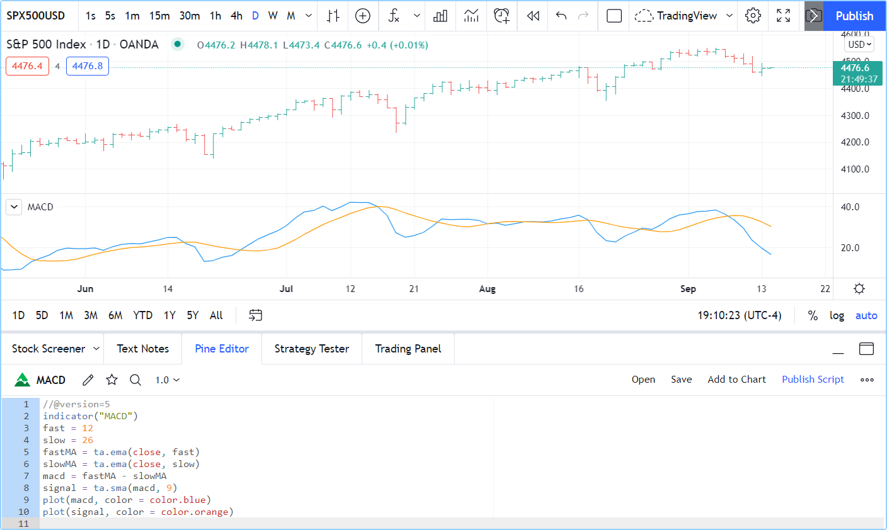

.. _PageFirstIndicator:

First indicator
===============

The Pine Editor
---------------

The Pine Editor is where you will be working on your scripts. While you can use any text editor you want to write your Pine scripts,
using our Editor has many advantages:

- It highlights your code following Pine syntax
- It pops up syntax reminders for built-in and library functions when you hover over them
- It provides quick access to the Pine Reference Manual popup when you CTRL + click on Pine keywords
- It makes the write/compile/run cycle fast because saving a new version of a script loaded on the chart also executes it immediately
- While not as feature-rich as the top editors out there, it provides key functionality such as auto-complete, search and replace, multi-cursor and versioning.

To open the Editor, click on the "Pine Editor" tab at the bottom of your TradingView chart. This will open up the Editor's pane.

First version
-------------

We will now create our first working Pine script, an implementation of the
`MACD <https://www.tradingview.com/support/solutions/43000502344-macd-moving-average-convergence-divergence/>`__ indicator in Pine:

.. code-block:: pine
    :linenos:

    //@version=5
    indicator("MACD")
    fast = 12
    slow = 26
    fastMA = ta.ema(close, fast)
    slowMA = ta.ema(close, slow)
    macd = fastMA - slowMA
    signal = ta.sma(macd, 9)
    plot(macd, color = color.blue)
    plot(signal, color = color.orange)

- Start by bringing up the "Open" dropdown menu at the top right of the Editor and choose "New blank indicator". 
- Then copy the example script below, taking care not to include the line numbers in your selection. 
- Select all the code already in the editor and replace it with the example script. 
- Click "Save" and choose a name for your script. Your script is now saved in TradingView's cloud, but under your account's name. Nobody but you can use it.
- Click "Add to Chart" in the Editor's menu bar. The MACD indicator appears in a separate *Pane* under your  chart.

Your first Pine script is running on your chart, which should look like this:

Let's look at our script's code, line by line:

Line 1: ``//@version=5``
    This is a comment containing a compiler directive that tells the compiler the script will use version 5 of Pine.
Line 2: ``indicator("MACD")``
    Defines the name of the script that will appear on the chart as "MACD".
Line 3: ``fast = 12``
    Defines a ``fast`` integer variable which will be the length of the fast EMA.
Line 4: ``slow = 26``
    Defines a ``slow`` integer variable which will be the length of the slow EMA.
Line 5: ``fastMA = ta.ema(close, fast)``
    Defines the variable ``fastMA``, containing the result of the
    EMA calculation (Exponential Moving Average) with a length equal
    to ``fast`` (12), on the ``close`` series, i.e., the closing price of bars.
Line 6: ``slowMA = ta.ema(close, slow)``
    Defines the variable ``slowMA``, containing the result of the
    EMA calculation with a length equal to ``slow`` (26), from ``close``.
Line 7: ``macd = fastMA - slowMA``
    Defines the variable ``macd`` as the difference between the two EMAs.
Line 8: ``signal = ta.sma(macd, 9)``
    Defines the variable ``signal`` as a smoothed value of
    ``macd`` using the SMA algorithm (Simple Moving Average) with
    a length of 9.
Line 9: ``plot(macd, color = color.blue)``
    Calls the ``plot`` function to output the variable ``macd`` using a blue line.
Line 10: ``plot(signal, color = color.orange)``
    Calls the ``plot`` function to output the variable ``signal`` using an orange line.

Second version
--------------

inputs
built-in macd

Third version
-------------

We are getting the hang of this! Let's see how we could add some bells and whistles to our creation.

