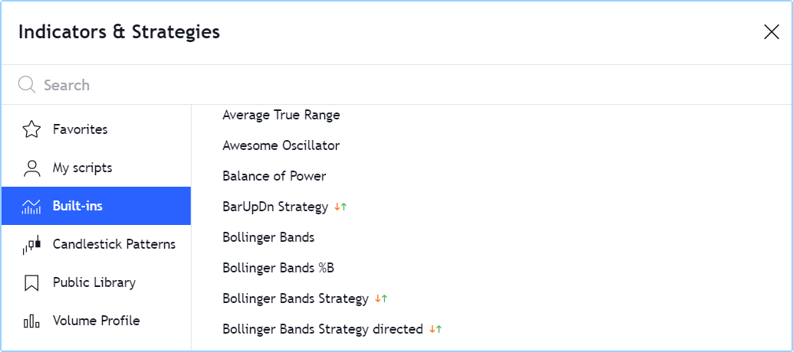

.. _PageFirstIndicator:

First steps
===========

.. contents:: :local:
    :depth: 3

Introduction
------------

Welcome to the `Pine Script User Manual <https://www.tradingview.com/pine-script-docs/en/v5/index.html>`__. 
In this page, we present a step-by-step approach that you can follow to gradually become more familiar with indicators and strategies (also called *scripts*) 
written in the Pine Script programming language on `TradingView <https://www.tradingview.com/>`__:

1. How to use the tens of thousands of existing scripts.
2. How to read the Pine code of existing scripts.
3. How to learn to write Pine scripts.

If you are already familiar with the use of Pine scripts on TradingView and are now ready to learn how to write your own,
then jump to the :ref:`<PageFirstIndicator_WritingScripts>` section of this page.

Using scripts
-------------

If you are interested in using technical indicators or strategies on TradingView, 
you can first start exploring the thousands of indicators already available on our platform. 
You can access existing indicators on the platform in two different ways:

- By using the chart's "Indicators & Strategies" button, or
- By browsing TradingView's `Puclic Library <https://www.tradingview.com/scripts/>`__, 
  the largest repository of scripts in the world, with more than 100,000 scripts, most of which are free and open-source, which means you can see their Pine code.

If you can find the tools you need already written for you, it can be a good way to get started and gradually become proficient as a script user, 
until you are ready to start your programming journey in Pine.

Loading scripts from the chart
^^^^^^^^^^^^^^^^^^^^^^^^^^^^^^

To explore and load scripts from you chart, use the "Indicators & Strategies" button:

.. image:: images/FirstSteps-FromTheChart-1.png

The dialog box presents different categories of scripts in its left pane:

- **Favorites** lists the scripts you have "favorited" by clicking on the star that appears to the left of its name when you mouse over it.
- **My scripts** displays the scipts you have written and saved in the Pine Editor. They are saved in TradingView's cloud.
- **Built-ins** groups the classic trading indicators that TradingView has written (mostly in Pine) and which are available for free.
- **Candlestick Patterns** are also built-ins supplied by TradingView. They have their distinct category because there are many.
- **Public Library** is where you can search from the 100,000+ published scripts written by TradingView users.
- **Volume Profile** includes volume profile indicators supplied by TradingView, but only available to Pro and Premium accounts. 
  These are not written in Pine and their source code is `na <https://www.tradingview.com/pine-script-reference/v5/#var_na>`__ (in Pine, ``na`` means "not available").

Here, the section containing the TradingView built-ins is selected:

When you click on one of the indicators or strategies (the ones with the green and red arrows following their name), it loads on your chart.

Browsing public scripts in the Public Library
^^^^^^^^^^^^^^^^^^^^^^^^^^^^^^^^^^^^^^^^^^^^^

From `TradingView's homepage <https://www.tradingview.com/>`__, you can bring up the Public Library's script stream from the "Community" menu. 
Here, we are pointing to the "Editors' Picks" section, but there are many other categories you can choose from:

.. image:: images/FirstSteps-FromThePublicLibrary-1.png

You can also search for scripts using the homepage's "Search" field, and filter scripts using different criteria. 
The Help Center has a page explaining the `different types of scripts <https://www.tradingview.com/scripts/?solution=43000558522>`__ in the Public Library.

The script feed shows script *widgets*, i.e., placeholders showing a miniature view of each publication's chart and description, and its author.
By clicking on it you will open the *script's page*, where you can see the script on a chart, read the author's description, like the script, leave comments or 
read the script's source code if it was published open-source.

Once you find an interesting script in the Public Library, follow the instructions in the Help Center to `load it on your chart <https://www.tradingview.com/script/?solution=43000555216>`__.

Changing script settings
^^^^^^^^^^^^^^^^^^^^^^^^

Once a script is loaded on the chart, you can double-click on its name (#1) to bring up its "Settings/Inputs" tab (#2): 

.. image:: images/FirstSteps-ChangingScriptSettings-1.png

The "Inputs" tab allows you to change the settings which the script's author has decided to make editable. 
You can configure some of the script's visuals using the "Style" tab of the same dialog box,
and which timeframes the script should appear on using the "Visibility" tab.

Other settings are available to all scripts from the buttons that appear to the right of its name when you mouse over it, 
and from the "More" menu (the three dots):

.. image:: images/FirstSteps-ChangingScriptSettings-2.png

Reading scripts
---------------

Reading code written by **good** programmers is the best way to develop your understanding of the language.
This is as true for Pine as it is for all other programming languages. 
Finding good open-source Pine code is relatively easy. These are reliable sources of code written by good programmers on TradingView:

- The TradingView built-in indicators
- Scripts selected as `Editors' Picks <https://www.tradingview.com/scripts/editors-picks/>`__
- Scripts by the `authors the PineCoders account follows <https://www.tradingview.com/u/PineCoders/#following-people>`__
- Scripts by authors with high reputation and many open-source publications.

Looking at code from scripts you find in the `Puclic Library <https://www.tradingview.com/scripts/>`__ is easy; 
if you don't see a grey or red lock in the upper-right corner of the script's widget, this indicates the script is open-source.
By opening its script page, you will be able to see its source.

To see the code of TradingView built-ins, load the indicator on your chart, then hover over its name and select the "Source code" curly braces icon 
(if you don't see it, it's because the indicator's source is unavailable). When you click on the icon, the Pine Editor will open and from there, 
you can see the script's code. If you want to play with it, you will need to use the Editor's "More" menu button at the top-right of the Editor's pane,
and select "Make a copy...". You will then be able to modify and save the code. Because you will have created a different version of the script, 
you will need to use the Editor's "Add to Chart" button to add that new copy to the chart.

This shows the Pine Editor having just opened because we selected the "View source" button from the indicator on our chart:

.. image:: images/FirstSteps-ReadingScripts-1.png

You can also open TradingView built-in indicators from the Pine Editor (accessible from the "Pine Editor" tab at the bottom of the chart) by 
using the "Open/New default built-in script...".

.. _PageFirstIndicator_WritingScripts:

Writing scripts
---------------

Learning to program in Pine will allow you to develop your own trading tools. , and to the community of Pine coders on TradingView. 
We have built Pine Script to empower both budding and seasoned traders to create their own trading tools. 

